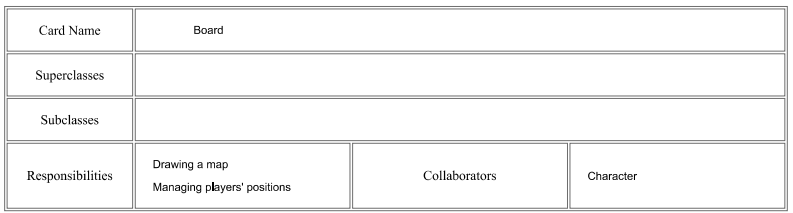
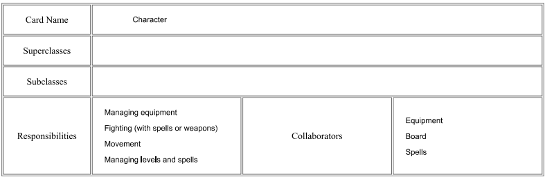
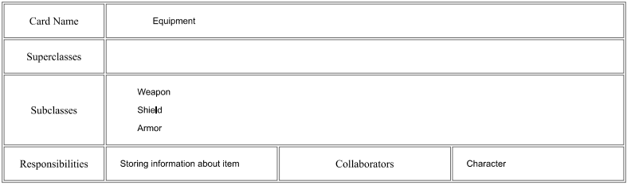
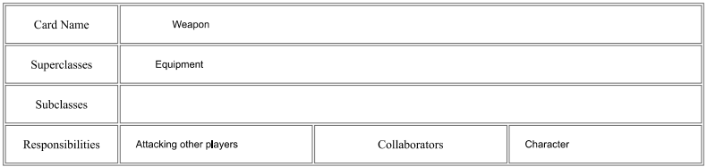
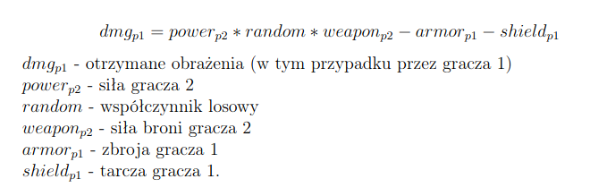
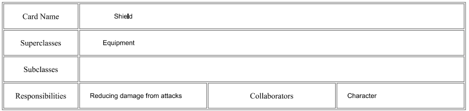
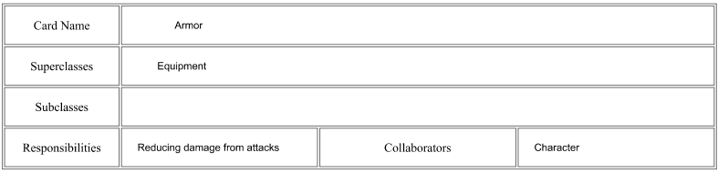
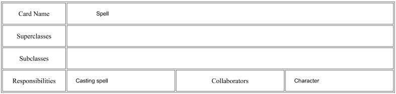
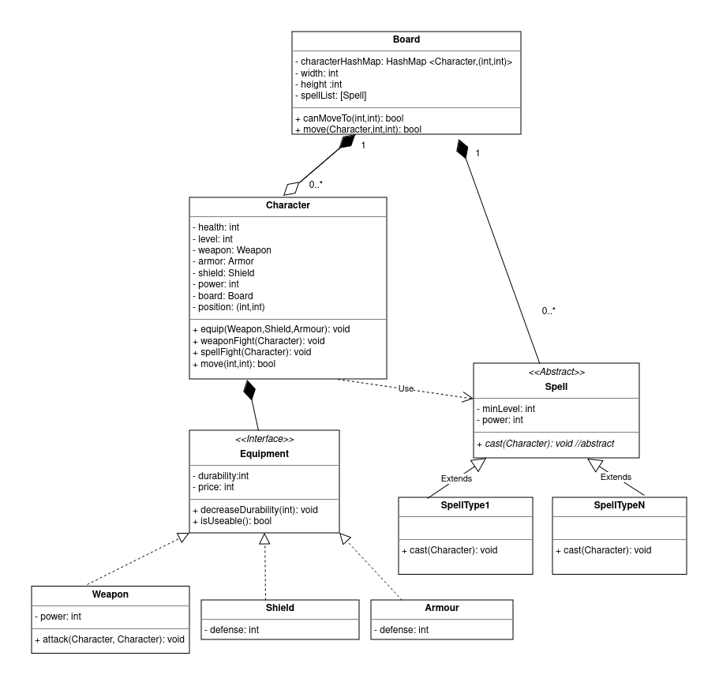

# Projektowanie Obiektowe - Laboratorium 1
Wykonali: *Urszula Stankiewicz, Tomasz Żmuda*

# Zadanie 1 (CRC)

Poniższe karty CRC prezentują klasy, w oparciu o które można zaimplementować moduł walki gry RPG. 

### 1. Plansza

Pierwszą z klas jest klasa Board, której zadaniem jest przechowywanie informacji o aktualnej pozycji graczy (dbając przy tym, aby gracze wykonywali tylko dozwolone ruchy, tj. nie wychodzili poza obręb planszy) oraz wyświetlanie planszy na ekranie. Klasa ta współpracuje z klasą Character. Przechowuje też listę dostępnych w grze zaklęć.

### 2. Postać

Klasa Character przechowuje informacje o postaci takie jak jej ekwipunek (broń, zbroja, tarcza), siła, poziom postaci. Ponadto dostarcza metod umożliwiających poruszanie się postaci po planszy oraz walkę z przeciwnikiem na dwa sposoby: za pomocą broni oraz czarów. Dla walki za pomocą czarów losuje dostępny na planszy czar, który ma poziom niewiększy od poziomu postaci. To samo robi dla przeciwnika. Postać, która wylosuje czar o większej sile rzuca go na przegranego.

 Klasa Character współpracuje z klasą Board (postaci są częścią planszy oraz przemieszczają się po niej), z klasą Spells (postać może rzucić czar na inną postać) oraz z interfejsem Equipment (postać posiada atrybuty będące instancjami tego interfejsu - zbroję, tarczę oraz broń).

### 3. Ekwipunek

Kolejnym obiektem w przedstawionym modelu CRC jest interfejs Equipment. Odpowiada on za przechowywanie informacji o danym ekwipunku - jego cenę oraz wytrzymałość. Interfejs Equipment współpracuje z klasą Character - jego instancje są atrybutami postaci oraz są wykorzystywane w czasie walki na broń. Interfejs posiada trzy implementacje: Weapon, Armor oraz Shield.

### 4. Broń

Klasa Weapon przechowuje informację o sile broni oraz metodę odpowiadającą za atak jednej postaci na drugą. W wyniku ataku dba, by siła postaci została obniżona zgodnie ze wzorem:

Klasa współpracuje z klasą Character - jest jej atrybutem oraz ma ważną rolę w walce postaci. Klasa Weapon implementuje interfejs Equipment.

### 5. Tarcza

Klasa Shield implementuje interfejs Equipment. Odpowiada za obronę postaci przed obrażeniami w czasie walki, posiada własny poziom obrony. Jest atrybutem klasy Character.

### 6. Zbroja

Klasa Armor jest klasą bardzo podobną do klasy Shield - również implementuje Equipment i odpowiada za redukcję obrażeń podczas walki według swojego poziomu obrony. Jest atrybutem klasy Character.

### 7. Czar

Klasa Spell przechowuje informację o minimalnym poziomie postaci, by wykorzystać zaklęcie, oraz siłę zaklęcia. Umożliwia rzucenie czaru na daną postać (przegraną w walce - patrz pkt 2) - specjalna metoda określa skutek czaru dla postaci - np. obniżenie siły broni czy levelu postaci.

### Sesja kart CRC

W sesji kart CRC na środku stołu ułożylibyśmy klasę Character - jest najważniejsza, to jej dotyczy większość operacji. Tuż obok ułożylibyśmy klasę Board - to na niej znajdują się postaci. Pod klasą Character ułożylibyśmy obok siebie interfejs Equipment oraz klasę Spell - współpracują z postacią podczas każdej walki. Pod interfejsem Equipment natomiast ułożylibyśmy klasy Armor, Shield oraz Weapon - implementują interfejs Equipment.

# Zadanie 2 (UML)

## Opis zastosowanych klas

### 1. Board

Klasa Board posiada listę postaci (Character), a postać posiada informację o planszy, na której się znajduje (relacja dwustronna: agregacja (po stronie Character) - kompozycja (po stronie Board))

Klasa Board posiada listę dostępnych w grze zaklęć  (relacja: kompozycja)

#### Atrybuty
* `characterHashMap: HashMap<Character, (int, int)>` - hashmapa zawierająca postaci znajdujące się na planszy wraz z ich pozycjami  
* `width: int` - szerokość planszy - postać nie może się znaleźć poza planszą  
* `height: int`- wysokość planszy  
* `spellList: [Spell]` - lista dostępnych w grze zaklęć (z tej listy postaci będą losować zaklęcia użyte w walce)

#### Metody
* `canMoveTo(int,int):bool` - sprawdza, czy postać może być przesunięta na pole o podanych współrzędnych (czy pole to nie jest poza planszą)  
* `move(Character, int, int): bool` - przemieszcza postać na wskazaną pozycję (jeśli to możliwe) - zmienia characterHashMap. Zwraca `true` jeśli operacja się powiodła, `false` w przeciwnym wypadku.

### 2. Character

Klasa Character posiada atrybuty będące instancjami Equipment (`weapon`, `armour`, `shield`) (relacja: kompozycja)

Klasa Board posiada listę postaci (Character), a postać posiada informację o planszy, na której się znajduje (relacja dwustronna: agregacja (po stronie Character) - kompozycja (po stronie Board))

#### Atrybuty
* `health: int` - zdrowie bohatera - zmniejsza się w wyniku odniesionych obrażeń  
* `level: int` - poziom bohatera - wpływa m.in. na to, które czary bohater może wylosować  
* `weapon: Weapon` - broń postaci  
* `shield: Shield` - tarcza postaci
* `power: int` - siła postaci - ma wpływ na wynik walki  
* `board: Board` - plansza, na której znajduje się postać  
* `position: (int,int)` - pozycja postaci na planszy
* `money: int` - pieniądze postaci

#### Metody
* `equip(Weapon, Shield, Armour):void` - ustawia ekwipunek postaci
* `weaponFight(Character):void` - odpowiada za walkę na broń z inną postacią. Obniża odpowiednio `health` postaci po walce o wartość odpowiadającą obrażeniom. Zmniejsza wytrzymałość ekwipunku po każdej walce.
* `spellFight(Character):void` - odpowiada za walkę na czary z inną postacią. Umożliwia każdemu z biorących udział w walce wylosowanie z listy dostępnych na planszy czarów takiego, którego minimalny poziom (`minLevel`) jest niewiększy od poziomu postaci (`level`). Następnie metoda rozstrzyga, który z graczy wygrał walkę (wygrywa ten, którego czar ma większą moc (`power`)). Wygrany rzuca czar na przegranego. Skutkiem czaru może być np. zmniejszenie wytrzymałości ekwipunku, zmiana pozycji na mapie, obrażenia, zmiana ilości pieniędzy postaci.
* `move(int a,int b): bool` - wywołuje metode `move` swojej planszy (`board`) z parametrami `board.move(self, a, b)`- jeśli ta zwróci `true`, postać zmienia swój atrybut position na `(a,b)`

### 3. Equipment

Klasy Weapon, Armour oraz Shield implementują interfejs Equipment (relacja: implementacja)

Klasa Character posiada atrybuty będące instancjami Equipment (`weapon`, `armour`, `shield`) (relacja: kompozycja)

#### Atrybuty
* `durability: int` - wytrzymałość ekwipunku - maksymalna ilość walk, które wytrzyma ekwipunek. Atrybut ten może być też zwiększany bądź zmniejszany przez czary
* `price: int` - cena ekwipunku, którą postać musi zapłacić, by ją nabyć

#### Metody
* `decreaseDurability(int): void` - zmniejsza wytrzymałość ekwipunku o podaną wartość
* `isUseable(): bool` - zwraca `true` jeśli wytrzymałość broni jest większa od 0, `false` w przeciwnym wypadku

### 4. Weapon

Implementuje interfejs Equipment (relacja z Equipment: implementacja).

#### Atrybuty

* `power: int` - siła broni

#### Metody
* `attack(Character a, Character b): void` - zwraca obrażenia zaatakowanego gracza (`Character b`)

### 5. Shield

Implementuje interfejs Equipment (relacja z Equipment: implementacja).

#### Atrybuty
* `defense: int` - wartość obrony tarczy

### 6. Armour

Implementuje interfejs Equipment (relacja z Equipment: implementacja).

#### Atrybuty
* `defense: int` - wartość obrony zbroji 
  
### 7. Spell

Klasa Character używa klasy Spell podczas walki na czary w metodzie `spellFight` (relacja z Character: zależność).

Klasy Spell1 - SpellN dziedziczą po klasie abstrakcyjnej Spell (relacja: dziedziczenie)

Klasa Board posiada listę dostępnych w grze zaklęć  (relacja: kompozycja)

#### Atrybuty
* `minLevel: int` - minimalny poziom postaci, by postać mogła skorzystać z czaru
* `power: int` - siła czaru
  
#### Metody
* `cast(Character): void` - Metoda abstarkcyjna. Rzuca czar na postać wskazaną parametrem. Każdy rodzaj czaru (klasa dziedzicząca po klasie abstrakcyjnej) może dawać inne skutki 

### 7. Klasy Spell1 - SpellN rozszerzające klasę Spell

Dziedziczą po klasie abstrakcyjnej Spell, implementując metodę `cast(Character): void`
 ## Diagram

 

