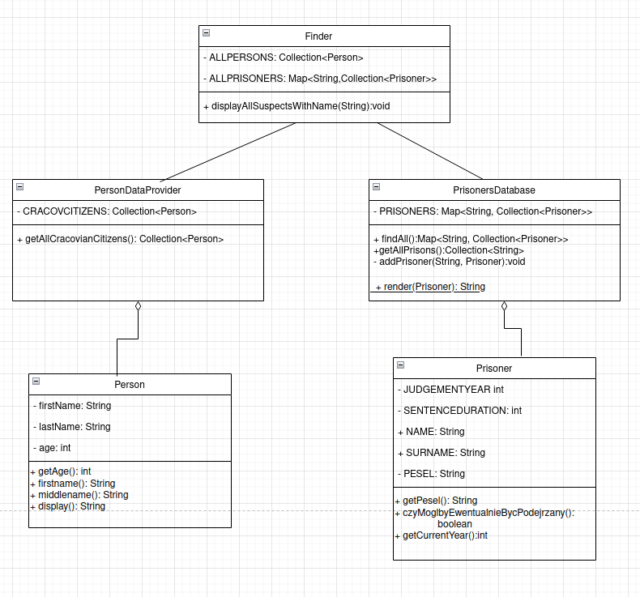
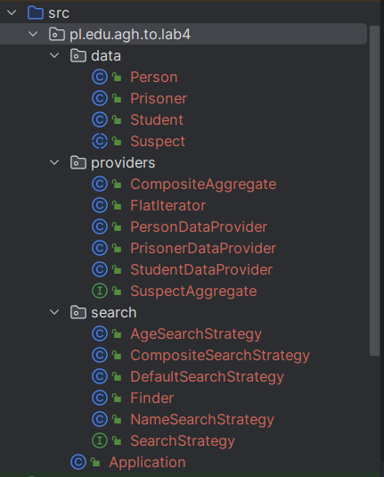

# Projektowanie obiektowe, Laboratorium nr 3
*Autor: Urszula Stankiewicz*
# Krok 1 i 2
Diagram UML na podstawie kodu:     


   


Błędy w strukturze kodu:
- Mieszanie polskich i angielskich nazw metod, np. czyMoglbyEwentualnieBycPodejrzany():boolean, wszystkie inne metody w języku angielskim
  - Zmieniam nazwę metody `public boolean czyMoglbyEwentualnieBycPodejrzany()` klasy Prisoner na `public boolean isInOfJail()`

- nazwy getterów powinny się zaczynać od słowa "get" (np. getter firstname(): String w klasie Person nie spełnia tego warunku)
  - zamieniam nazwę metody `firstname()` klasy Person na `getFirstname()` oraz `middlename()` na `getSurname()`. Dla jednolitości zmieniam też nazwę atrybutu `name` klasy Prisoner na `firstname` 
- zamieniam nazwę metody `display()` klasy Person na `toString()` - będzie można z niej korzystać np. w ten sposób `System.out.println(person)` zamiast `System.out.println(person.display())`  
- widoczność metod:
  - metoda getCurrentYear() mogłaby być prywatna, gdyż nie
- stosowanie bardzo generalnego typu Collection zamiast np. List (np. `private final Map<String, Collection<Prisoner>> prisoners = new HashMap<String, Collection<Prisoner>>();`)
- atrybuty publiczne -> należy utworzyć gettery i zamienić atrybuty publiczne na prywatne:
  - tworzę merody getName(), getSurname() oraz zamieniam modyfikator public na private dla atrybutów name, surname klasy Prisoner
- zamieniam `public static String render(Prisoner prisoner)` (modyfikator static jest tu niepoprawny) klasy PrisonersDatabase na `public String toString()` w klasie Prisoner. Dzięki temu zamiast
 ```java
for (Prisoner n : suspectedPrisoners) {
    System.out.println(PrisonersDatabase.render(n));
}
``` 
w klasie Finder metodzie displayAllSuspectsWithName możemy umieścić (zmieniam też nazwę zmiennej n na prisoner dla czytelności):

```java
for (Prisoner prisoner : suspectedPrisoners) {
    System.out.println(prisoner);
}
```
- w klasie PrisonersDatabase zmieniam nazwę metody `findAll` na bardziej intuicyjną i opisującą `getPrisoners`
- zmieniam nazwę klasy `PersonDataProvider` na `CracowCitizens`, a klasy `PrisonersDatabase` na `Prisoners`


Na koniec otrzymujemy kod:
```java
public class Prisoners {

    private final Map<String, Collection<Prisoner>> prisoners = new HashMap<String, Collection<Prisoner>>();

    public Prisoners() {
        addPrisoner("Wiezienie krakowskie", new Prisoner("Jan", "Kowalski", "87080452357", 2005, 7));
        addPrisoner("Wiezienie krakowskie", new Prisoner("Anita", "Wiercipieta", "84080452357", 2009, 3));
        addPrisoner("Wiezienie krakowskie", new Prisoner("Janusz", "Zlowieszczy", "92080445657", 2001, 10));
        addPrisoner("Wiezienie przedmiejskie", new Prisoner("Janusz", "Zamkniety", "802104543357", 2010, 5));
        addPrisoner("Wiezienie przedmiejskie", new Prisoner("Adam", "Future", "880216043357", 2020, 5));
        addPrisoner("Wiezienie przedmiejskie", new Prisoner("Zbigniew", "Nienajedzony", "90051452335", 2011, 1));
        addPrisoner("Wiezienie centralne", new Prisoner("Jan", "Przedziwny", "91103145223", 2009, 4));
        addPrisoner("Wiezienie centralne", new Prisoner("Janusz", "Podejrzany", "85121212456", 2012, 1));
    }

    public Map<String, Collection<Prisoner>> getPrisoners() {
        return prisoners;
    }

    public Collection<String> getAllPrisons() {
        return prisoners.keySet();
    }

    private void addPrisoner(String category, Prisoner prisoner) {
        if (!prisoners.containsKey(category))
            prisoners.put(category, new ArrayList<Prisoner>());
        prisoners.get(category).add(prisoner);
    }
    
}


public class Prisoner {
    private final int judgementYear;

    private final int senteceDuration;

    private final String pesel;

    private final String firstname;

    private final String surname;

    public Prisoner(String firstname, String surname, String pesel, int judgementYear, int sentenceDuration) {
        this.firstname = firstname;
        this.surname = surname;
        this.pesel = pesel;
        this.judgementYear = judgementYear;
        this.senteceDuration = sentenceDuration;
    }

    public String getFirstname(){return firstname;}
    public String getSurname() {
        return surname;
    }
    public String getPesel() {
        return pesel;
    }

    public boolean isInJail() {
        return judgementYear + senteceDuration >= getCurrentYear();
    }

    public int getCurrentYear() {
        return Calendar.getInstance().get(Calendar.YEAR);
    }

    @Override
    public String toString() {
        return getFirstname() + " " + getSurname();
    }

}
public class Person {
    private String firstname;

    private String lastname;

    private int age;

    public Person(String firstname, String lastname, int age) {
        this.age = age;
        this.firstname = firstname;
        this.lastname = lastname;
    }

    public int getAge() {
        return age;
    }

    public String firstname() {
        return firstname;
    }

    public String getSurname() {
        return lastname;
    }

    @Override
    public String toString() {
        return firstname + " " + lastname;
    }
}


public class Finder {
    private final Collection<Person> allPersons;

    private final Map<String, Collection<Prisoner>> allPrisoners;

    public Finder(Collection<Person> allPersons, Map<String, Collection<Prisoner>> allPrisoners) {
        this.allPersons = allPersons;
        this.allPrisoners = allPrisoners;
    }

    public Finder(CracowCitizens cracowCitizens, Prisoners prisoners) {
        this(cracowCitizens.getAllCracovCitizens(), prisoners.getPrisoners());
    }

    public void displayAllSuspectsWithName(String name) {
        ArrayList<Prisoner> suspectedPrisoners = new ArrayList<Prisoner>();
        ArrayList<Person> suspectedPersons = new ArrayList<Person>();

        for (Collection<Prisoner> prisonerCollection : allPrisoners.values()) {
            for (Prisoner prisoner : prisonerCollection) {
                if (!prisoner.isInJail() && prisoner.getFirstname().equals(name)) {
                    suspectedPrisoners.add(prisoner);
                }
                if (suspectedPrisoners.size() >= 10) {
                    break;
                }
            }
            if (suspectedPrisoners.size() >= 10) {
                break;
            }
        }

        if (suspectedPrisoners.size() < 10) {
            for (Person person : allPersons) {
                if (person.getAge() > 18 && person.firstname().equals(name)) {
                    suspectedPersons.add(person);
                }
                if (suspectedPrisoners.size() + suspectedPersons.size() >= 10) {
                    break;
                }
            }
        }

        int t = suspectedPrisoners.size() + suspectedPersons.size();
        System.out.println("Znalazlem " + t + " pasujacych podejrzanych!");

        for (Prisoner prisoner : suspectedPrisoners) {
            System.out.println(prisoner);
        }

        for (Person p : suspectedPersons) {
            System.out.println(p.toString());
        }
    }
}
public class CracowCitizens {

    private final Collection<Person> cracovCitizens = new ArrayList<Person>();

    public CracowCitizens() {
        cracovCitizens.add(new Person("Jan", "Kowalski", 30));
        cracovCitizens.add(new Person("Janusz", "Krakowski", 30));
        cracovCitizens.add(new Person("Janusz", "Mlodociany", 10));
        cracovCitizens.add(new Person("Kasia", "Kosinska", 19));
        cracovCitizens.add(new Person("Piotr", "Zgredek", 29));
        cracovCitizens.add(new Person("Tomek", "Gimbus", 14));
        cracovCitizens.add(new Person("Janusz", "Gimbus", 15));
        cracovCitizens.add(new Person("Alicja", "Zaczarowana", 22));
        cracovCitizens.add(new Person("Janusz", "Programista", 77));
        cracovCitizens.add(new Person("Pawel", "Pawlowicz", 32));
        cracovCitizens.add(new Person("Krzysztof", "Mendel", 30));
    }

    public Collection<Person> getAllCracovCitizens() {
        return cracovCitizens;
    }

}


```

# Krok 3

- Tworzę interfejs Suspect, który będą implementować klasy Person oraz Prisoner. Interfejs zawieraz atrybuty firstname oraz lastname, a także defaultowe implementacje metod toString(), getFirstName(), getLastName(). Takie rozwiązanie pozwala uniknąć powtarzania kodu (takiego samego dla obu klas). Ponadto będziemy w stanie stworzyć listę podejrzanych, do której trafią zarówno instancje klasy Person, jak i Prisoner. Ułatwi to operacje na zbiorach podejrzanych. W ramach refaktoryzacji:
  - usuwamy atrybuty firstname, lastname z obu klas, a także gettery i settery tych atrybutów i metodę toString(), umieszczając ten kod w klasie Suspect
  - W klasie Finder używana była dotąd klasa Collection do zdefiniowania listy więźniów oraz osób. Nie jest to najlepsze rozwiązanie, należy zastosować typ bardziej dokładny - w tym przypadku List.
  - W klasie Finder możemy teraz zamiast dwóch list allPersons oraz allPrisoners użyć jednej listy suspects zawierającej zarówno instancje klasy Person, jak i Prisoner. Dzięki temu wszystkich podejrzanych będziemy mogli przetwarzać w ten sam sposób. Musimy teraz nieco zmienić testy, by dodwane osoby i więźniowie z poziomu testów również znaleźli się w liście suspects. Ponadto, zauważyłam błąd w teście `testNotDisplayingJailedPrisoner`: prawdopodobnie zadanie było układane, kiedy jeszcze Jan Kowalski2 siedział w więzieniu, dlatego jego nazwisko nie powinno się znaleźć w zbiorze wynikowym. W celu korekty testu, zmieniam jego wyrok z 20 lat na 24. Cała klasa `FinderTest` będzie teraz wyglądać następująco:
    ```java
    package pl.edu.agh.to.lab4;

    import java.io.ByteArrayOutputStream;
    import java.io.PrintStream;
    import java.util.*;

    import org.junit.After;
    import org.junit.Before;
    import org.junit.Test;

    import static org.junit.Assert.assertFalse;
    import static org.junit.Assert.assertTrue;

    public class FinderTest {
        private ByteArrayOutputStream outContent = new ByteArrayOutputStream();

        private PrintStream originalOut;

        private List<Person> allPersons = new ArrayList<>();

        private Map<String, List<Prisoner>> allPrisoners = new HashMap<>();

        private Finder suspectFinder = new Finder(allPersons, allPrisoners);

        @Test
        public void testDisplayingNotJailedPrisoner() {
            addPrisoner("Wiezeienie stanowe", new Prisoner("Jan", "Kowalski", "802104543357", 2000, 1));
            suspectFinder.displayAllSuspectsWithName("Jan");
            assertContentIsDisplayed("Jan Kowalski");
        }

        @Test
        public void testDisplayingSuspectedPerson() {
            suspectFinder.addSuspect(new Person("Jan", "Kowalski", 20));
            suspectFinder.displayAllSuspectsWithName("Jan");
            assertContentIsDisplayed("Jan Kowalski");
        }

        @Test
        public void testNotDisplayingTooYoungPerson() {
            suspectFinder.addSuspect(new Person("Jan", "Kowalski", 15));
            suspectFinder.displayAllSuspectsWithName("Jan");
            assertContentIsNotDisplayed("Jan Kowalski");
        }

        @Test
        public void testNotDisplayingJailedPrisoner() {
            suspectFinder.addSuspect(new Person("Jan", "Kowalski", 20));
            addPrisoner("Wiezeienie stanowe", new Prisoner("Jan", "Kowalski2", "802104543357", 2000, 24));
            suspectFinder.displayAllSuspectsWithName("Jan");
            assertContentIsNotDisplayed("Jan Kowalski2");
        }

        private void assertContentIsDisplayed(String expectedContent) {
            assertTrue("Application did not contain expected content: " + outContent.toString(), outContent.toString()
                    .contains(expectedContent));
        }

        private void assertContentIsNotDisplayed(String expectedContent) {
            assertFalse("Application did contain expected content although it should not: " + outContent.toString(), outContent.toString()
                    .contains(expectedContent));
        }

        @Before
        public void redirectSystemOut() {
            originalOut = System.out;
            System.setOut(new PrintStream(outContent));
        }

        @After
        public void resetSystemOut() {
            System.setOut(originalOut);
        }

        private void addPrisoner(String category, Prisoner newPrisoner) {
            if (!allPrisoners.containsKey(category))
                allPrisoners.put(category, new ArrayList<Prisoner>());
            allPrisoners.get(category).add(newPrisoner);
            suspectFinder.addSuspect(newPrisoner);
        }
    }

    ```
    Podobnie musimy uaktualnić test `testPrisonerIsInJail` w PrisonerTest, zmieniając wyrok Jana Kowalskiego z 5 na 13 lat:
    ```java
    public class PrisonerTest {
        @Test
        public void testPrisonerIsInJail() {
            Prisoner news = new Prisoner("Jan", "Kowalski", "802104543357", 2011, 13);
            assertTrue(news.isInJail());
        }

        @Test
        public void testPrisonerHasBeenReleasedFromJail() {
            Prisoner news = new Prisoner("Jan", "Kowalski", "802104543357", 2008, 5);
            assertFalse(news.isInJail());
        }
    }
    ```

  - W klasie Suspect tworzymy metodę abstrakcyjną `public abstract boolean isSuspect(String name);`, która będzie zwracać true, jeśli dana osoba/więzień jest podejrzany i false w przeciwnym wypadku. Każda z podklas będzie musiała zaimplementować swoją wersję metody, a w klasie Finder tylko je wywołamy dla każdego elementu listy suspects i te elementy, dla których metoda isSuspect zwróci true, dodamy do listy podejrzanych (`List<Suspect> allSuspected`). Otrzymany w ten sposób zbiór wynikowy, który wystarczy wyświetlić na standardowym wyjściu.

Po opisanych zmianach klasy Finder, Person, Suspect, Prisoner będą wyglądać następująco:

```java
package pl.edu.agh.to.lab4;

import java.util.ArrayList;
import java.util.Collection;
import java.util.List;
import java.util.Map;

public class Finder {


    private final List<Suspect> suspects=new ArrayList<>();

    public Finder(List<Person> allPersons, Map<String, List<Prisoner>> allPrisoners) {

        for(List<Prisoner> prisoners:allPrisoners.values()){
            this.suspects.addAll(prisoners);
        }
        this.suspects.addAll(allPersons);

    }


    public Finder(CracowCitizens cracowCitizens, Prisoners prisoners) {
        this(cracowCitizens.getAllCracovCitizens(), prisoners.getPrisoners());
    }

    public void addSuspect(Suspect suspect){
        suspects.add(suspect);
    }

    public void displayAllSuspectsWithName(String name) {
        List<Suspect> allSuspected=new ArrayList<>();

        for(Suspect suspect:suspects){
            if(suspect.isSuspect(name)){
                allSuspected.add(suspect);
            }
            if(allSuspected.size()>=10){
                break;
            }
        }


        System.out.println("Znalazlem " + allSuspected.size() + " pasujacych podejrzanych!");

        for(Suspect suspect:allSuspected){
            System.out.println(suspect);
        }
    }
}
package pl.edu.agh.to.lab4;

import java.util.List;

public class Person extends Suspect{


    private int age;

    public Person(String firstname, String lastname, int age) {
        super(firstname,lastname);
        this.age = age;
    }

    public int getAge() {
        return age;
    }


    @Override
    public boolean isSuspect( String name) {


        return(this.getAge() > 18 && this.getFirstname().equals(name));
    }
}
package pl.edu.agh.to.lab4;

import java.util.List;

public abstract class Suspect {
    protected String firstname;

    protected String lastname;

    public Suspect(String firstname, String lastname){
        this.firstname=firstname;
        this.lastname=lastname;
    }

    public String getFirstname() {
        return firstname;
    }

    public String getSurname() {
        return lastname;
    }

    @Override
    public String toString() {
        return firstname + " " + lastname;
    }

    public abstract boolean isSuspect(String name);
}
package pl.edu.agh.to.lab4;

import java.util.ArrayList;
import java.util.Calendar;
import java.util.Collection;
import java.util.List;

public class Prisoner extends Suspect{
    private final int judgementYear;

    private final int senteceDuration;

    private final String pesel;


    public Prisoner(String firstname, String lastname, String pesel, int judgementYear, int sentenceDuration) {
        super(firstname,lastname);
        this.pesel = pesel;
        this.judgementYear = judgementYear;
        this.senteceDuration = sentenceDuration;
    }


    public String getPesel() {
        return pesel;
    }

    public boolean isInJail() {
        return judgementYear + senteceDuration >= getCurrentYear();
    }

    public int getCurrentYear() {
        return Calendar.getInstance().get(Calendar.YEAR);
    }

    @Override
    public String toString() {
        return super.getFirstname() + " " + getSurname();
    }

    @Override
    public boolean isSuspect( String name) {


        return (!this.isInJail() && this.getFirstname().equals(name));
    }

}


```

# Kroki 4,5

Dodajemy interfejs SuspectAggregate, która spełnia wzorzec Dekorator. Po tym interfejsie będą dziedziczyć klasy PersonDataProvider (wcześniej CracovCitizens) oraz PrisonerDataProvider (zmieniona nazwa z Prisoners). Interfejs ten zawiera tylko jedną metodę (iterator()). Implementujemy też klasę FlatIterator, która umożliwia iterowanie po więźniach. W praktyce tworzymy atrybut `private final List<Suspect> prisoners=new ArrayList<>();`, który zawiera wszystkich więźniów ze wszystkich więzień, a następnie tworzymy metody hasNext() oraz next(), które posługują się metodami iteratora po atrybucie prisoners. Następnie tworzymy klasę CompositeAggregate, która implementuje wzorzec kompozyt i zawiera listę obiektów typu SuspectAggregate oraz metodę getSuspects, która dzięki zaimplementowanym iteratorom z każdego obiektu typu SuspectAggregate wyciąga listę podejrzanych i zwraca wspólną listę wynikową. Uaktualniamy ponownie testy tak, by pasowały do stosowanych struktur danych.

Testy `FinderTest`:
```java
package pl.edu.agh.to.lab4;

import java.io.ByteArrayOutputStream;
import java.io.PrintStream;
import java.util.*;

import org.junit.After;
import org.junit.Before;
import org.junit.Test;

import static org.junit.Assert.assertFalse;
import static org.junit.Assert.assertTrue;

public class FinderTest {
    private final ByteArrayOutputStream outContent = new ByteArrayOutputStream();

    private PrintStream originalOut;

    private final List<Person> allPersons = new ArrayList<>();

    private final Map<String, List<Prisoner>> allPrisoners = new HashMap<>();

    private final PersonDataProvider personDataProvider=new PersonDataProvider(allPersons);
    private final PrisonerDataProvider prisonerDataProvider=new PrisonerDataProvider(allPrisoners);
    private final CompositeAggregate aggregate=new CompositeAggregate(List.of(personDataProvider,
            prisonerDataProvider));
    private final Finder suspectFinder = new Finder(aggregate);

    @Test
    public void testDisplayingNotJailedPrisoner() {
        addPrisoner("Wiezeienie stanowe", new Prisoner("Jan", "Kowalski", "802104543357", 2000, 1));
        suspectFinder.displayAllSuspectsWithName("Jan");
        assertContentIsDisplayed("Jan Kowalski");
    }

    @Test
    public void testDisplayingSuspectedPerson() {
        allPersons.add(new Person("Jan", "Kowalski", 20));
        suspectFinder.displayAllSuspectsWithName("Jan");
        assertContentIsDisplayed("Jan Kowalski");
    }

    @Test
    public void testNotDisplayingTooYoungPerson() {
        allPersons.add(new Person("Jan", "Kowalski", 15));
        suspectFinder.displayAllSuspectsWithName("Jan");
        assertContentIsNotDisplayed("Jan Kowalski");
    }

    @Test
    public void testNotDisplayingJailedPrisoner() {
        allPersons.add(new Person("Jan", "Kowalski", 20));
        addPrisoner("Wiezeienie stanowe", new Prisoner("Jan", "Kowalski2", "802104543357", 2000, 24));
        suspectFinder.displayAllSuspectsWithName("Jan");
        assertContentIsNotDisplayed("Jan Kowalski2");
    }

    private void assertContentIsDisplayed(String expectedContent) {
        assertTrue("Application did not contain expected content: " + outContent.toString(), outContent.toString()
                .contains(expectedContent));
    }

    private void assertContentIsNotDisplayed(String expectedContent) {
        assertFalse("Application did contain expected content although it should not: " + outContent.toString(), outContent.toString()
                .contains(expectedContent));
    }

    @Before
    public void redirectSystemOut() {
        originalOut = System.out;
        System.setOut(new PrintStream(outContent));
    }

    @After
    public void resetSystemOut() {
        System.setOut(originalOut);
    }

    private void addPrisoner(String category, Prisoner newPrisoner) {
        if (!allPrisoners.containsKey(category))
            allPrisoners.put(category, new ArrayList<Prisoner>());
        allPrisoners.get(category).add(newPrisoner);


    }
}

```

Klasy Finder, CompositeAggregate, SuspectAggregate, PersonDataProvider, PrisonerDataProvider:

```java
package pl.edu.agh.to.lab4;

import java.util.ArrayList;
import java.util.Collection;
import java.util.List;
import java.util.Map;

public class Finder {
    private final CompositeAggregate aggregate;

    private final List<Suspect> suspects=new ArrayList<>();

    public Finder(CompositeAggregate aggregate) {
        this.aggregate=aggregate;
    }


    public Finder(PersonDataProvider cracowCitizens, PrisonerDataProvider prisoners) {

        this(new CompositeAggregate(List.of(cracowCitizens,prisoners)));
    }


    public void displayAllSuspectsWithName(String name) {
        List<Suspect> suspects=aggregate.getSuspects();
        List<Suspect> allSuspected=new ArrayList<>();

        for(Suspect suspect:suspects){
            if(suspect.isSuspect(name)){
                allSuspected.add(suspect);
            }
            if(allSuspected.size()>=10){
                break;
            }
        }


        System.out.println("Znalazlem " + allSuspected.size() + " pasujacych podejrzanych!");

        for(Suspect suspect:allSuspected){
            System.out.println(suspect);
        }
    }
}
package pl.edu.agh.to.lab4;

import java.util.ArrayList;
import java.util.Iterator;
import java.util.List;

public class CompositeAggregate {

    private final List<SuspectAggregate> dataProviders;

    public CompositeAggregate(List<SuspectAggregate> dataProviders) {
        this.dataProviders = dataProviders;

    }


    public List<Suspect> getSuspects() {
        List<Suspect> suspects = new ArrayList<>();

        for (SuspectAggregate data : dataProviders) {
            Iterator<Suspect> dataIterator = data.iterator();
            while (dataIterator.hasNext()) {

                suspects.add(dataIterator.next());
            }

        }

        return suspects;
    }


}
package pl.edu.agh.to.lab4;

import java.util.Iterator;

public interface SuspectAggregate {
    Iterator<Suspect> iterator();
}
package pl.edu.agh.to.lab4;

import java.util.ArrayList;
import java.util.Collection;
import java.util.Iterator;
import java.util.List;

public class PersonDataProvider implements SuspectAggregate{

    private List<Person> cracovCitizens = new ArrayList<Person>();

    public PersonDataProvider() {
        cracovCitizens.add(new Person("Jan", "Kowalski", 30));
        cracovCitizens.add(new Person("Janusz", "Krakowski", 30));
        cracovCitizens.add(new Person("Janusz", "Mlodociany", 10));
        cracovCitizens.add(new Person("Kasia", "Kosinska", 19));
        cracovCitizens.add(new Person("Piotr", "Zgredek", 29));
        cracovCitizens.add(new Person("Tomek", "Gimbus", 14));
        cracovCitizens.add(new Person("Janusz", "Gimbus", 15));
        cracovCitizens.add(new Person("Alicja", "Zaczarowana", 22));
        cracovCitizens.add(new Person("Janusz", "Programista", 77));
        cracovCitizens.add(new Person("Pawel", "Pawlowicz", 32));
        cracovCitizens.add(new Person("Krzysztof", "Mendel", 30));
    }

    public PersonDataProvider(List<Person> people) {cracovCitizens=people;
    }

    public List<Person> getAllCracovCitizens() {
        return cracovCitizens;
    }

    @Override
    public Iterator<Suspect> iterator() {
        return ((Collection<Suspect>)(Collection<?>) cracovCitizens).iterator();
    }
}
package pl.edu.agh.to.lab4;

import java.util.*;

public class PrisonerDataProvider implements  SuspectAggregate{

    private Map<String, List<Prisoner>> prisoners = new HashMap<>();

    public PrisonerDataProvider() {
        addPrisoner("Wiezienie krakowskie", new Prisoner("Jan", "Kowalski", "87080452357", 2005, 7));
        addPrisoner("Wiezienie krakowskie", new Prisoner("Anita", "Wiercipieta", "84080452357", 2009, 3));
        addPrisoner("Wiezienie krakowskie", new Prisoner("Janusz", "Zlowieszczy", "92080445657", 2001, 10));
        addPrisoner("Wiezienie przedmiejskie", new Prisoner("Janusz", "Zamkniety", "802104543357", 2010, 5));
        addPrisoner("Wiezienie przedmiejskie", new Prisoner("Adam", "Future", "880216043357", 2020, 5));
        addPrisoner("Wiezienie przedmiejskie", new Prisoner("Zbigniew", "Nienajedzony", "90051452335", 2011, 1));
        addPrisoner("Wiezienie centralne", new Prisoner("Jan", "Przedziwny", "91103145223", 2009, 4));
        addPrisoner("Wiezienie centralne", new Prisoner("Janusz", "Podejrzany", "85121212456", 2012, 1));
    }

    public PrisonerDataProvider(Map<String, List<Prisoner>> prisoners) {
        this.prisoners=prisoners;
    }

    public Map<String, List<Prisoner>> getPrisoners() {
        return prisoners;
    }

    public Collection<String> getAllPrisons() {
        return prisoners.keySet();
    }

    public void setPrisoners( Map<String, List<Prisoner>> prisoners){
        this.prisoners=prisoners;
    }

    private void addPrisoner(String category, Prisoner prisoner) {
        if (!prisoners.containsKey(category))
            prisoners.put(category, new ArrayList<Prisoner>());
        prisoners.get(category).add(prisoner);
    }

    @Override
    public Iterator<Suspect> iterator() {
        return new FlatIterator(prisoners);
    }
}


```

# Krok 6

Implementujemy interfejs SearchStrategy, a także klasy AgeSearchStrategy (szuka osób które mieszczą się w podanym przedziale wiekowym), NameSearchStrategy (szuka osób o podanym imieniu i nazwisku), CompositeSearchStrategy (łączy różne sposoby wyszukiwania). Ponadto implementuję klasy Student oraz StudentProvider, których wcześniej nie było oraz klasę DefaultSearchStrategy, która wyszukuje w sposób, który był zaimplementowany początkowo w kodzie (korzystając z metod isSuspect podklas klasy abstrakcyjnej Suspect). Ten też sposób jest wykorzystywany w testach. Ponadto dzielę klasy na pakiety w celu uporządkowania kodu:   

   

Teraz zaimplementowanie klasy wyglądają następująco:

```java
package pl.edu.agh.to.lab4.data;

public class Student extends Suspect {

    String index;
    int age;

    public Student(String firstname, String lastname, String index, int age) {
        super(firstname, lastname);
        this.index = index;
        this.age = age;
    }

    @Override
    public boolean isSuspect(String name) {
        return true;
    }

    @Override
    public int getAge() {
        return age;
    }

    @Override
    public String toString() {
        return "Student: index: " + index + ", Name: " + super.toString();
    }
}


```

```java


package pl.edu.agh.to.lab4.providers;

import pl.edu.agh.to.lab4.data.Student;
import pl.edu.agh.to.lab4.data.Suspect;

import java.util.ArrayList;
import java.util.Iterator;
import java.util.List;

public class StudentDataProvider implements SuspectAggregate {

    private final List<Student> students = new ArrayList<>();

    public StudentDataProvider() {
        students.add(new Student("Adam", "Michalik", "415783", 20));
        students.add(new Student("Marek", "Kowalczyk", "414783", 20));
        students.add(new Student("Mikołaj", "Szajowski", "415782", 20));
        students.add(new Student("Adam", "Kalisz", "415744", 20));
        students.add(new Student("Ewa", "Urbańska", "414383", 20));
        students.add(new Student("Konrad", "Michalski", "423783", 20));

    }

    @Override
    public Iterator<Suspect> iterator() {
        return null;
    }
}

```
```java
package pl.edu.agh.to.lab4.search;

import pl.edu.agh.to.lab4.data.Suspect;
import pl.edu.agh.to.lab4.providers.CompositeAggregate;
import pl.edu.agh.to.lab4.providers.PersonDataProvider;
import pl.edu.agh.to.lab4.providers.PrisonerDataProvider;

import java.util.ArrayList;
import java.util.List;

public class Finder {
    private final CompositeAggregate aggregate;

    private final List<Suspect> suspects = new ArrayList<>();
    private final CompositeSearchStrategy searchStrategy;

    public Finder(CompositeAggregate aggregate) {

        this.aggregate = aggregate;
        searchStrategy = new CompositeSearchStrategy(List.of());
    }

    public Finder(CompositeAggregate aggregate, CompositeSearchStrategy searchStrategy) {

        this.aggregate = aggregate;
        this.searchStrategy = searchStrategy;
    }


    public Finder(PersonDataProvider cracowCitizens, PrisonerDataProvider prisoners) {

        this(new CompositeAggregate(List.of(cracowCitizens, prisoners)));
    }


    public void displayAllSuspectsWithName(String name) {
        List<Suspect> suspects = aggregate.getSuspects();
        List<Suspect> allSuspected = new ArrayList<>();
        CompositeSearchStrategy searchStrategy1 = new CompositeSearchStrategy(List.of(new DefaultSearchStrategy(name)));

        for (Suspect suspect : suspects) {
            if (searchStrategy1.filter(suspect)) {
                allSuspected.add(suspect);
            }
            if (allSuspected.size() >= 10) {
                break;
            }
        }


        System.out.println("Znalazlem " + allSuspected.size() + " pasujacych podejrzanych!");

        for (Suspect suspect : allSuspected) {
            System.out.println(suspect);
        }
    }


    public void displayAllSuspectsWithName() {
        List<Suspect> suspects = aggregate.getSuspects();
        List<Suspect> allSuspected = new ArrayList<>();

        for (Suspect suspect : suspects) {
            if (searchStrategy.filter(suspect)) {
                allSuspected.add(suspect);
            }
            if (allSuspected.size() >= 10) {
                break;
            }
        }


        System.out.println("Znalazlem " + allSuspected.size() + " pasujacych podejrzanych!");

        for (Suspect suspect : allSuspected) {
            System.out.println(suspect);
        }
    }
}

```

```java
package pl.edu.agh.to.lab4.search;

import pl.edu.agh.to.lab4.data.Suspect;

public interface SearchStrategy {

    boolean filter(Suspect suspect);

}
```

```java
package pl.edu.agh.to.lab4.search;

import pl.edu.agh.to.lab4.data.Suspect;

public class DefaultSearchStrategy implements SearchStrategy {

    String name;

    public DefaultSearchStrategy(String name) {
        this.name = name;
    }

    @Override
    public boolean filter(Suspect suspect) {
        return suspect.isSuspect(name);
    }
}

```


```java
package pl.edu.agh.to.lab4.search;

import pl.edu.agh.to.lab4.data.Suspect;

public class NameSearchStrategy implements SearchStrategy {
    String firstName;
    String lastName;

    public NameSearchStrategy(String firstName, String lastName) {
        this.firstName = firstName;
        this.lastName = lastName;
    }

    @Override
    public boolean filter(Suspect suspect) {
        System.out.println(suspect.getFirstname());
        return (suspect.getFirstname().equals(firstName) || firstName == null)
                && (lastName == null || suspect.getSurname().equals(lastName));
    }
}
```


```java
    int minAge;
    int maxAge;

    public AgeSearchStrategy(int minAge, int maxAge) {
        this.minAge = minAge;
        this.maxAge = maxAge;
    }

    @Override
    public boolean filter(Suspect suspect) {
        return (suspect.getAge() >= minAge && suspect.getAge() <= maxAge);
    }
```


```java
package pl.edu.agh.to.lab4.search;

import pl.edu.agh.to.lab4.data.Suspect;

import java.util.List;

public class CompositeSearchStrategy implements SearchStrategy {
    List<SearchStrategy> searchStrategyList;

    public CompositeSearchStrategy(List<SearchStrategy> searchStrategyList) {
        this.searchStrategyList = searchStrategyList;
    }


    @Override
    public boolean filter(Suspect suspect) {
        return searchStrategyList
                .stream()
                .allMatch(searchStrategy -> searchStrategy.filter(suspect));
    }
}
```

Dzięki zastosowaniu wzorca kompozyt możemy później w wygodny i niewymagający dużych zmian sposób rozwijać kod, dodając nowe sposoby wyszukiwania oraz zestawy danych. Ponadto łączenie wielu zestawów danych oraz sposobów wyszukiwania jest bardzo proste.

# Podsumowanie
Początkowo kod był mało czytelny i nie do końca poprawny ze względu na zastosowane niejasne nazwy atrybutów i metod oraz mieszanie polskich nazw z angielskimi, a także niepoprawne użycie modyfikatorów. Ponadto sporo kodu się powtarzało ze względu na wspólne cechy klas Prisoner oraz Person. Dodatkową wadą był fakt, że dalsza rozbudowa projektu wiązałaby się z koniecznością redesignu całego projektu. Zastosowane wzorce projektowe kompozyt oraz dekorator pozwalają zaradzić temu problemowi. Dzięki nim możemy w łatwy sposób np. dodawać nowe strategie wyszukiwania i zastawy danych, a także dowolnie je łączyć. Poprawa modyfikatorów, formatowania kodu oraz nazwenictwa dodatkowo zwiększa czytelność i ułatwia pracę z kodem.