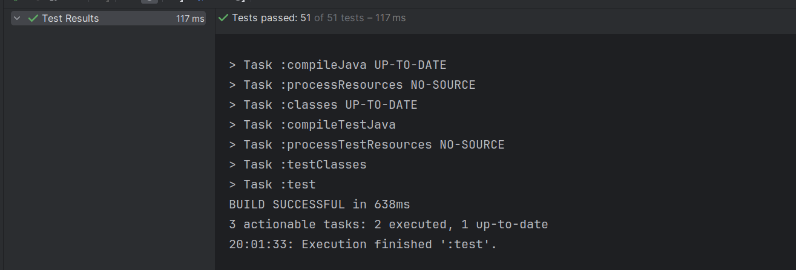

# Projektowanie obiektowe, laboratorium nr 4
*Autor: Urszula Stankiewicz*


# Zadanie 1

Dodaję możliwość zmiany wartości podatku (metod `public void set_tax_value(BigDecimal tax_value)` w klasie `Order`). Dodaję też odpowiedni getter oraz oczywiście usuwam modyfikator final dla atrybutu tax_value:

```java
public class Order {
    private static BigDecimal tax_value = BigDecimal.valueOf(1.22); //defaultowo mamy starą wartość

    //(...)

    public void set_tax_value(BigDecimal tax_value){
        this.tax_value=tax_value;
    }

    public BigDecimal get_tax_value(){
        return tax_value;
    }

}

```

Dodajemy stosowne testy dla gettera oraz settera, a także nowe testy dla funkcji wyliczającej cenę:

```java
    	@Test
	public void testSetTaxValue(){
		//given
		Order order=getOrderWithMockedProduct();

		//when
		order.set_tax_value(BigDecimal.valueOf(1.23));

		//then
		assertBigDecimalCompareValue(order.get_tax_value(),BigDecimal.valueOf(1.23));

	}

	@Test
	public void testTaxValueWithoutSetting(){
		//given
		Order order=getOrderWithMockedProduct();

		//when

		//then
		assertBigDecimalCompareValue(order.get_tax_value(),BigDecimal.valueOf(1.22));

	}


	@Test
	public void testPriceWithTaxesWithoutRoundUpNewTaxPrice() {
		// given

		// when
		Order order = getOrderWithCertainProductPrice(2); // 2 PLN
		order.set_tax_value(BigDecimal.valueOf(1.23));

		// then
		assertBigDecimalCompareValue(order.getPriceWithTaxes(), BigDecimal.valueOf(2.46)); // 2.46 PLN


	}

	@Test
	public void testPriceWithTaxesWithRoundDownNewTaxPrice() {
		// given

		// when
		Order order = getOrderWithCertainProductPrice(0.01); // 0.01 PLN
		order.set_tax_value(BigDecimal.valueOf(1.23));

		// then
		assertBigDecimalCompareValue(order.getPriceWithTaxes(), BigDecimal.valueOf(0.01)); // 0.01 PLN
		// given

		// when
		Order order2 = getOrderWithCertainProductPrice(5.23); // 5.23 PLN
		order2.set_tax_value(BigDecimal.valueOf(1.23));

		// then
		assertBigDecimalCompareValue(order2.getPriceWithTaxes(), BigDecimal.valueOf(6.43)); //6.43 PLN

	}

	@Test
	public void testPriceWithTaxesWithRoundUpNewTaxValue() {
		// given

		// when
		Order order = getOrderWithCertainProductPrice(0.03); // 0.03 PLN
		order.set_tax_value(BigDecimal.valueOf(1.23));

		// then
		assertBigDecimalCompareValue(order.getPriceWithTaxes(), BigDecimal.valueOf(0.04)); // 0.04 PLN

	}
```


# Zadanie 2

- Zmieniam atrybut `private final Product product` klasy Order na `private final List<Product> products`, poprawiam postać konstruktora, metodę `getProduct` zamieniam na jej nową wersję `getProducts` oraz poprawiam metodę `getPrice`:
  ```java
      public Order(List<Product> products) {
        this.products = products;
        id = UUID.randomUUID();
        paid = false;
    }

	public List<Product> getProducts() {
        return products;
    }

    public BigDecimal getPrice() {
        return products.stream().map(Product::getPrice).reduce(BigDecimal.valueOf(0),BigDecimal::add);
    }
		
	```
- Poprawiam też odpowiednio testy (tutaj prezentuję tylko te, które zmieniam):
  ```java

	private Order getOrderWithMockedProducts() {
        List<Product> products = new ArrayList<>();
        for(int i=0;i<10;i++){
            Product product=mock(Product.class);
            products.add(product);
        }
        return new Order(products);
    }

    @Test
    public void testGetProductThroughOrder() {
        // given
        List<Product> expectedProducts = new ArrayList<>();
        for(int i=0;i<10;i++){
            Product product=mock(Product.class);
            expectedProducts.add(product);
        }
        Order order = new Order(expectedProducts);
        // when
        List<Product> actualProducts = order.getProducts();

        // then
        assertSame(expectedProducts, actualProducts);
    }

	@Test
    public void testGetPrice() throws Exception {
        // given
        BigDecimal expectedProductPrice = BigDecimal.valueOf(150);
        List<Product> products=new ArrayList<>();

        for(int i=0;i<10;i++){
            Product product=mock(Product.class);
            given(product.getPrice()).willReturn(BigDecimal.valueOf(15));
            products.add(product);
        }
        Order order = new Order(products);

        // when
        BigDecimal actualProductPrice = order.getPrice();

        // then
        assertBigDecimalCompareValue(expectedProductPrice, actualProductPrice);
    }

 	@Test
 	private Order getOrderWithCertainProductPrice(double productPriceValue) {
        List<Product> products = new ArrayList<>();
        for(int i=0;i<10;i++){
            Product product=mock(Product.class);
            given(product.getPrice()).willReturn(BigDecimal.valueOf(productPriceValue/10));
            products.add(product);
        }
        return new Order(products);
    }

    @Test
    public void testPriceWithTaxesWithoutRoundUp() {
        // given

        // when
        Order order = getOrderWithCertainProductPrice(2); // 2 PLN
        order.set_tax_value(BigDecimal.valueOf(1.22));

        // then
        assertBigDecimalCompareValue(order.getPriceWithTaxes(), BigDecimal.valueOf(2.44)); // 2.44 PLN
    }

    @Test
    public void testPriceWithTaxesWithoutRoundUpNewTaxPrice() {
        // given

        // when
        Order order = getOrderWithCertainProductPrice(2); // 2 PLN
        order.set_tax_value(BigDecimal.valueOf(1.23));

        // then
        assertBigDecimalCompareValue(order.getPriceWithTaxes(), BigDecimal.valueOf(2.46)); // 2.46 PLN


    }

    @Test
    public void testPriceWithTaxesWithRoundDownNewTaxPrice() {
        // given

        // when
        Order order = getOrderWithCertainProductPrice(0.01); // 0.01 PLN
        order.set_tax_value(BigDecimal.valueOf(1.23));

        // then
        assertBigDecimalCompareValue(order.getPriceWithTaxes(), BigDecimal.valueOf(0.01)); // 0.01 PLN
        // given

        // when
        Order order2 = getOrderWithCertainProductPrice(5.23); // 5.23 PLN
        order2.set_tax_value(BigDecimal.valueOf(1.23));

        // then
        assertBigDecimalCompareValue(order2.getPriceWithTaxes(), BigDecimal.valueOf(6.43)); //6.43 PLN

    }

    @Test
    public void testPriceWithTaxesWithRoundDown() {
        // given

        // when
        Order order = getOrderWithCertainProductPrice(0.01); // 0.01 PLN

        // then
        assertBigDecimalCompareValue(order.getPriceWithTaxes(), BigDecimal.valueOf(0.01)); // 0.01 PLN

    }


    @Test
    public void testPriceWithTaxesWithRoundUpNewTaxValue() {
        // given

        // when
        Order order = getOrderWithCertainProductPrice(0.03); // 0.03 PLN
        order.set_tax_value(BigDecimal.valueOf(1.23));

        // then
        assertBigDecimalCompareValue(order.getPriceWithTaxes(), BigDecimal.valueOf(0.04)); // 0.04 PLN

    }


    @Test
    public void testPriceWithTaxesWithRoundUp() {
        // given

        // when
        Order order = getOrderWithCertainProductPrice(0.03); // 0.03 PLN

        // then
        assertBigDecimalCompareValue(order.getPriceWithTaxes(), BigDecimal.valueOf(0.04)); // 0.04 PLN

    }
	```

# Zadanie 3

- dodaję następujące atrybuty do klasy `Order`:
  ```java
	private final BigDecimal defaultProductDiscount = BigDecimal.ONE;
    private BigDecimal orderDiscount = BigDecimal.ONE;
    private final HashMap<Product, BigDecimal> productDiscounts = new HashMap<>();
  ```
- W konstruktorze ustawiam dodatkowo zniżkę każdego produktu na defaultProductDiscount (początkowo zakładamy, że na żaden produkt nie mamy zniżki):
  ```java
	public Order(List<Product> products) {
        this.products = products;
        for (Product product : products) {
            productDiscounts.put(product, defaultProductDiscount);
        }
        id = UUID.randomUUID();
        paid = false;
    }
  ```
- dodaję settery dla zniżek (kontroluję, czy zniżka mieści się w przedziale [0,1] - zniżka 1 oznacza, że w zamówieniu należy opłacić pełną cenę produktu/zamówienia a zniżka 0, że za produkt/zamówienie nie zapłacimy wcale)
  ```java
    public BigDecimal getOrderDiscount() {
        return orderDiscount;
    }

    public void setOrderDiscount(BigDecimal orderDiscount) {
        if(orderDiscount.compareTo(BigDecimal.ONE)>0 || orderDiscount.compareTo(BigDecimal.ZERO)<0){
            throw new IllegalArgumentException("Discount must be between 0 and 1!");
        }
        this.orderDiscount = orderDiscount;
    }

    public void setProductDiscount(Product product, BigDecimal discount)throws IllegalArgumentException {
        if(discount.compareTo(BigDecimal.ONE)>0 || discount.compareTo(BigDecimal.ZERO)<0){
            throw new IllegalArgumentException("Discount must be between 0 and 1!");
        }
        productDiscounts.put(product, discount);
    }
	```
- poprawiam metodę `getPrice` tak, by uwzględniała wszystkie zniżki:
	```java
	public BigDecimal getPrice() {
        return products.stream()
                .map(product -> product.getPrice().multiply(productDiscounts.get(product)))
                .reduce(BigDecimal.valueOf(0), BigDecimal::add)
                .multiply(orderDiscount);
    }
	```
- dodaję testy, które sprawdzają działanie nowej funkcjonalności: testuję, czy dla błędnych argumentów rzucany jest wyjątek `IllegalArgumentException` oraz czy `getPrice` zwraca prawidłową cenę zamówienia:
  ```java
	    @Test
    public void testProductDiscountsIllegalArgument(){
        //given
        List<Product> products = new ArrayList<>();
        for(int i=0;i<10;i++){
            Product product=mock(Product.class);
            given(product.getPrice()).willReturn(BigDecimal.valueOf(15));
            products.add(product);
        }
        //when
        Order order=new Order(products);
        
        //then
        assertThrows(IllegalArgumentException.class,()->order.setProductDiscount(products.get(0),BigDecimal.valueOf(2)));
        assertThrows(IllegalArgumentException.class,()->order.setProductDiscount(products.get(0),BigDecimal.valueOf(-0.1)));
    }

    @Test
    public void testProductDiscountsLegalArgument(){
        //given
        BigDecimal expectedPrice=BigDecimal.valueOf(14.28);
        List<Product> products = new ArrayList<>();
        for(int i=0;i<10;i++){
            Product product=mock(Product.class);
            given(product.getPrice()).willReturn(BigDecimal.valueOf(1.7));
            products.add(product);
        }
        //when
        Order order=new Order(products);

        order.setProductDiscount(products.get(0),BigDecimal.ZERO);
        order.setProductDiscount(products.get(1),BigDecimal.valueOf(0.4));

        //then        
        assertBigDecimalCompareValue(order.getPrice(),expectedPrice);
    }

    @Test
    public void testOrderDiscountsIllegalArgument(){
        //given
        List<Product> products = new ArrayList<>();
        for(int i=0;i<10;i++){
            Product product=mock(Product.class);
            given(product.getPrice()).willReturn(BigDecimal.valueOf(15));
            products.add(product);
        }
        //when
        Order order=new Order(products);
        
        //then
        assertThrows(IllegalArgumentException.class,()->order.setOrderDiscount(BigDecimal.valueOf(2)));
        assertThrows(IllegalArgumentException.class,()->order.setOrderDiscount(BigDecimal.valueOf(-0.1)));
    }

    @Test
    public void testOrderDiscountsLegalArgument(){
        //given
        BigDecimal expectedPrice=BigDecimal.valueOf(6.8);
        List<Product> products = new ArrayList<>();
        for(int i=0;i<10;i++){
            Product product=mock(Product.class);
            given(product.getPrice()).willReturn(BigDecimal.valueOf(1.7));
            products.add(product);
        }
        //when
        Order order=new Order(products);
        order.setOrderDiscount(BigDecimal.valueOf(0.4));
        
        //then
        assertBigDecimalCompareValue(order.getPrice(),expectedPrice);
    }

    @Test
    public void testOrderAndProductDiscounts(){
        //given
        BigDecimal expectedPrice=BigDecimal.valueOf(5.712);
        List<Product> products = new ArrayList<>();
        for(int i=0;i<10;i++){
            Product product=mock(Product.class);
            given(product.getPrice()).willReturn(BigDecimal.valueOf(1.7));
            products.add(product);
        }
        //when
        Order order=new Order(products);

        order.setOrderDiscount(BigDecimal.valueOf(0.4));
        order.setProductDiscount(products.get(0),BigDecimal.ZERO);
        order.setProductDiscount(products.get(1),BigDecimal.valueOf(0.4));
        
        //then
        assertBigDecimalCompareValue(order.getPrice(),expectedPrice);
    }
  ```
- Dodaję też testy sprawdzające poprawność wyliczenia ceny ze zniżkami i podatkiem:
  ```java
   @Test
    public void testOrderWithDiscountsAndTaxesWithoutRound(){
        //given
        BigDecimal expectedPrice=BigDecimal.valueOf(51.66);
        List<Product> products = new ArrayList<>();
        for(int i=0;i<10;i++){
            Product product=mock(Product.class);
            given(product.getPrice()).willReturn(BigDecimal.valueOf(10));
            products.add(product);
        }
        //when
        Order order=new Order(products);

        order.setOrderDiscount(BigDecimal.valueOf(0.5));
        order.setProductDiscount(products.get(0),BigDecimal.ZERO);
        order.setProductDiscount(products.get(1),BigDecimal.valueOf(0.4));
        order.set_tax_value(BigDecimal.valueOf(1.23));

        //then
        assertBigDecimalCompareValue(order.getPriceWithTaxes(),expectedPrice);
    }

    @Test
    public void testOrderWithDiscountsAndTaxesWithRoundUp(){
        //given
        BigDecimal expectedPrice=BigDecimal.valueOf(7.03);
        List<Product> products = new ArrayList<>();
        for(int i=0;i<10;i++){
            Product product=mock(Product.class);
            given(product.getPrice()).willReturn(BigDecimal.valueOf(1.7));
            products.add(product);
        }
        //when
        Order order=new Order(products);
        order.set_tax_value(BigDecimal.valueOf(1.23));

        order.setOrderDiscount(BigDecimal.valueOf(0.4));
        order.setProductDiscount(products.get(0),BigDecimal.ZERO);
        order.setProductDiscount(products.get(1),BigDecimal.valueOf(0.4));

        //then
        assertBigDecimalCompareValue(order.getPriceWithTaxes(),expectedPrice);
    }

    @Test
    public void testOrderWithDiscountsAndTaxesWithRoundDown(){
        //given
        BigDecimal expectedPrice=BigDecimal.valueOf(8.78);
        List<Product> products = new ArrayList<>();
        for(int i=0;i<10;i++){
            Product product=mock(Product.class);
            given(product.getPrice()).willReturn(BigDecimal.valueOf(1.7));
            products.add(product);
        }
        //when
        Order order=new Order(products);
        order.set_tax_value(BigDecimal.valueOf(1.23));

        order.setOrderDiscount(BigDecimal.valueOf(0.5));
        order.setProductDiscount(products.get(0),BigDecimal.ZERO);
        order.setProductDiscount(products.get(1),BigDecimal.valueOf(0.4));

        //then
        assertBigDecimalCompareValue(order.getPriceWithTaxes(),expectedPrice);
    }
	```
# Zadanie 4
- tworzę klasę `OrderHistory`, która będzie przechowywała historię zamówień w formie listy klasy Order oraz pozwalała odfiltrować zamówienia za pomocą podanego filtra klasy `OrderHistoryFilter`:
  ```java
  public class OrderHistory {
    private List<Order> orders;

    public OrderHistory(List<Order> orders){
        this.orders=orders;
    }

    public List<Order> getOrders() {
        return orders;
    }

    public void addOrder(Order order) {
        orders.add(order);
    }

    public List<Order> filterOrders(OrderHistoryFilter orderFilter){
        return orders.stream().filter(orderFilter::filterOrders).toList();
    }


	}
	```

- w nowym pakiecie orderfilter tworzę mechanizm filtrowania oparty na wzorcu projektowym budowniczy (Builder). Tworzę interfejs `FilterBuilder` dla budowniczego, który zawiera 4 metody: 

	```java
	public interface FilterBuilder {
		void setName(String name);
		void setProductName(String product);
		void setPrice(BigDecimal price, CompareType type);
		void setPriceWithTaxes(BigDecimal price, CompareType type);
	}
	```
	Implementować ten interfejs będzie klasa OrderHistoryFilterBuilder. Klasa ta pozwaka ustawić odpowiednimi setterami nazwisko kupującego, nazwę produktu, cenę oraz cenę z podatkiem i sposób porównywania cen, a następnie metodą `getResult` stworzyć obiekt OrderHistoryFilter z ustawionymi parametrami (lub ich brakiem):
	```java
	public class OrderHistoryFilterBuilder implements FilterBuilder{
		private String name;
		private String productName;
		private BigDecimal price;
		private CompareType priceCompareType;
		private BigDecimal priceWithTaxes;
		private CompareType priceWithTaxesCompareType;

		@Override
		public void setName(String name) {
			this.name=name;
		}

		@Override
		public void setProductName(String product) {
			this.productName=product;
		}

		@Override
		public void setPrice(BigDecimal price, CompareType type) {
			this.price=price;
			this.priceCompareType=type;
		}

		@Override
		public void setPriceWithTaxes(BigDecimal price, CompareType type) {
			this.priceWithTaxes=price;
			this.priceWithTaxesCompareType=type;
		}

		public OrderHistoryFilter getResult(){
			return new OrderHistoryFilter(name,productName,price,priceWithTaxes,priceCompareType,priceWithTaxesCompareType);
		}

	}
	```
- Sposób porównywania cen `priceCompareType` oraz `priceWithTaxesCompareType` są typu `CompareType`. Jest to enum o następującej postaci:
  ```java
	public enum CompareType {
		EQUAL,
		GREATER,
		SMALLER,
		GEQ,
		SEQ
	}
	```
	EQUAL odpowiada sytuacji, gdy szukane zamówienie o cenie/cenie z podatkiem równej tej stworzonej przez budowniczego w klasie `OrderHistoryFilter`. Analogicznie GREATER pozwala odfiltrować tylko zamówienia o cenie wyższej niż podana, SMALLER o cenie niższej, GEQ wyższej lub równej, SEQ niższej lub równej
- Sama klasa filtrująca wygląda następująco:
	```java
	public class OrderHistoryFilter {
		private final String name;
		private final String productName;
		private final BigDecimal price;
		private final CompareType priceCompareType;
		private final BigDecimal priceWithTaxes;
		private final CompareType priceWithTaxesCompareType;
		public OrderHistoryFilter() {
			this(null,null,null,null,null,null);

		}

		public OrderHistoryFilter(String name, String product, BigDecimal price, BigDecimal priceWithTaxes,CompareType priceCompareType, CompareType priceWithTaxesCompareType) {
			this.name = name;
			this.productName = product;
			this.price = price;
			this.priceWithTaxes=priceWithTaxes;
			this.priceCompareType=priceCompareType;
			this.priceWithTaxesCompareType=priceWithTaxesCompareType;
		}

		public boolean filterOrders(Order order) {
			return (getPrice() == null || comparePrices(order.getPrice(),getPrice(),priceCompareType))
					&& (getPriceWithTaxes() == null || comparePrices(order.getPriceWithTaxes(),getPriceWithTaxes(),priceWithTaxesCompareType))
					&& (getName() == null || order.getShipment().getSenderAddress().getName().equals(getName()))
					&& (getProductName() == null || !order.getProducts().stream().filter(product -> product.getName().equals(getProductName())).toList().isEmpty());
		}

		public boolean comparePrices(BigDecimal price1, BigDecimal price2, CompareType type){
			return switch(type){
				case EQUAL-> price1.compareTo(price2)==0;
				case GEQ -> price1.compareTo(price2)>=0;
				case SEQ -> price1.compareTo(price2)<=0;
				case SMALLER-> price1.compareTo(price2)<0;
				case GREATER -> price1.compareTo(price2)>0;
			};

		}

		public String getName() {
			return name;
		}

		public String getProductName() {
			return productName;
		}

		public BigDecimal getPrice() {
			return price;
		}

		public BigDecimal getPriceWithTaxes() {
			return priceWithTaxes;
		}

		public CompareType getPriceCompareType() {
			return priceCompareType;
		}

		public CompareType getPriceWithTaxesCompareType() {
			return priceWithTaxesCompareType;
		}

		@Override
		public boolean equals(Object o) {
			if (this == o) return true;
			if (o == null || getClass() != o.getClass()) return false;
			OrderHistoryFilter that = (OrderHistoryFilter) o;
			return Objects.equals(getName(), that.getName()) && Objects.equals(getProductName(), that.getProductName()) && Objects.equals(getPrice(), that.getPrice()) && getPriceCompareType() == that.getPriceCompareType() && Objects.equals(getPriceWithTaxes(), that.getPriceWithTaxes()) && getPriceWithTaxesCompareType() == that.getPriceWithTaxesCompareType();
		}

		@Override
		public int hashCode() {
			return Objects.hash(getName(), getProductName(), getPrice(), getPriceCompareType(), getPriceWithTaxes(), getPriceWithTaxesCompareType());
		}
	}
	```

	Oprócz getterów i metod equals i hashCode klasa posiada dwie metody: 
	- `comparePrices`, która dla danego typu porównania zwraca true jeśli porównanie dwóch podanych cen jest prawdziwe, false w przeciwnym wypadku
	- `filterOrders`, która zwraca true, jeśli dane argumentem zamówienie spełnia kryteria filtrowania, false w przeciwnym wypadku
- Piszę testy dla klas `OrderHistoryFilterBuilder`, `OrderHistoryFilter`, `OrderHistory`:  
  Dla `OrderHistoryFilterBuilder`:
  ```java
	public class OrderHistoryFilterBuilderTest {

		@Test
		public void testSetName(){
			//given
			OrderHistoryFilter expectedFilter=new OrderHistoryFilter("Kowalski",null,null,
					null,null,null);
			//when
			OrderHistoryFilterBuilder builder=new OrderHistoryFilterBuilder();

			builder.setName("Kowalski");

			//then
			Assertions.assertEquals(builder.getResult(),expectedFilter);
		}

		@Test
		public void testSetPrice(){
			//given
			OrderHistoryFilter expectedFilter=new OrderHistoryFilter(null,null,BigDecimal.valueOf(1.43),
					null, CompareType.EQUAL,null);
			//when
			OrderHistoryFilterBuilder builder=new OrderHistoryFilterBuilder();

			builder.setPrice(BigDecimal.valueOf(1.43), CompareType.EQUAL );

			//then
			Assertions.assertEquals(builder.getResult(),expectedFilter);
		}

		@Test
		public void testSetPriceWithTaxes(){
			//given
			OrderHistoryFilter expectedFilter=new OrderHistoryFilter(null,null,null,BigDecimal.valueOf(1.43),
					null,CompareType.GEQ);
			//when
			OrderHistoryFilterBuilder builder=new OrderHistoryFilterBuilder();

			builder.setPriceWithTaxes(BigDecimal.valueOf(1.43), CompareType.GEQ );

			//then
			Assertions.assertEquals(builder.getResult(),expectedFilter);
		}

		@Test
		public void testSetProductName(){
			//given
			String product="Jabłko";
			OrderHistoryFilter expectedFilter=new OrderHistoryFilter(null,product,
					null,null,null,null);
			//when
			OrderHistoryFilterBuilder builder=new OrderHistoryFilterBuilder();

			builder.setProductName(product);

			//then
			Assertions.assertEquals(builder.getResult(),expectedFilter);
		}
	}
	```

	Dla `OrderHistoryFilter`:
	```java
	public class OrderHistoryFilterTest {

		@Test
		public void testComparePricesEQ(){
			//given
			BigDecimal price1=BigDecimal.valueOf(2.34);
			BigDecimal price2=BigDecimal.valueOf(2.34);
			BigDecimal price3=BigDecimal.valueOf(2.33);
			CompareType type=CompareType.EQUAL;
			//when
			OrderHistoryFilter orderHistoryFilter=new OrderHistoryFilter();
			//then
			Assertions.assertTrue(orderHistoryFilter.comparePrices(price1,price2,type));
			Assertions.assertFalse(orderHistoryFilter.comparePrices(price1,price3,type));
		}

		@Test
		public void testComparePricesGEQ(){
			//given
			BigDecimal price1=BigDecimal.valueOf(2.34);
			BigDecimal price2=BigDecimal.valueOf(2.34);
			BigDecimal price3=BigDecimal.valueOf(2.33);
			CompareType type=CompareType.GEQ;
			//when
			OrderHistoryFilter orderHistoryFilter=new OrderHistoryFilter();
			//then
			Assertions.assertTrue(orderHistoryFilter.comparePrices(price1,price2,type));
			Assertions.assertTrue(orderHistoryFilter.comparePrices(price1,price3,type));
			Assertions.assertFalse(orderHistoryFilter.comparePrices(price3,price1,type));
		}

		@Test
		public void testComparePricesSEQ(){
			//given
			BigDecimal price1=BigDecimal.valueOf(2.34);
			BigDecimal price2=BigDecimal.valueOf(2.34);
			BigDecimal price3=BigDecimal.valueOf(2.33);
			CompareType type=CompareType.SEQ;
			//when
			OrderHistoryFilter orderHistoryFilter=new OrderHistoryFilter();
			//then
			Assertions.assertTrue(orderHistoryFilter.comparePrices(price1,price2,type));
			Assertions.assertTrue(orderHistoryFilter.comparePrices(price3,price1,type));
			Assertions.assertFalse(orderHistoryFilter.comparePrices(price1,price3,type));
		}
		@Test
		public void testComparePricesGreater(){
			//given
			BigDecimal price1=BigDecimal.valueOf(2.34);
			BigDecimal price2=BigDecimal.valueOf(2.34);
			BigDecimal price3=BigDecimal.valueOf(2.33);
			CompareType type=CompareType.GREATER;
			//when
			OrderHistoryFilter orderHistoryFilter=new OrderHistoryFilter();
			//then
			Assertions.assertFalse(orderHistoryFilter.comparePrices(price1,price2,type));
			Assertions.assertFalse(orderHistoryFilter.comparePrices(price3,price1,type));
			Assertions.assertTrue(orderHistoryFilter.comparePrices(price1,price3,type));
		}

		@Test
		public void testComparePricesSmaller(){
			//given
			BigDecimal price1=BigDecimal.valueOf(2.34);
			BigDecimal price2=BigDecimal.valueOf(2.34);
			BigDecimal price3=BigDecimal.valueOf(2.33);
			CompareType type=CompareType.SMALLER;
			//when
			OrderHistoryFilter orderHistoryFilter=new OrderHistoryFilter();
			//then
			Assertions.assertFalse(orderHistoryFilter.comparePrices(price1,price2,type));
			Assertions.assertTrue(orderHistoryFilter.comparePrices(price3,price1,type));
			Assertions.assertFalse(orderHistoryFilter.comparePrices(price1,price3,type));
		}

		@Test
		public void testFilterOrdersTrue(){
			//given
			Order order=mock(Order.class);
			Address address=mock(Address.class);
			Shipment shipment=mock(Shipment.class);
			String productName="Jabłko";
			Product product1=mock(Product.class);
			Product product2=mock(Product.class);
			Product product3=mock(Product.class);
			String name="Kowalski";
			BigDecimal price=BigDecimal.valueOf(20.34);
			BigDecimal priceWithTaces=BigDecimal.valueOf(25.54);
			CompareType type=CompareType.EQUAL;

			given(address.getName()).willReturn(name);
			given(shipment.getSenderAddress()).willReturn(address);
			given(product1.getName()).willReturn(productName);
			given(product2.getName()).willReturn("lorem ipsum");
			given(product3.getName()).willReturn("sth");

			given(order.getPrice()).willReturn(price);
			given(order.getPriceWithTaxes()).willReturn(priceWithTaces);
			given(order.getShipment()).willReturn(shipment);
			given(order.getProducts()).willReturn(List.of(product1,product2,product3));

			//when
			OrderHistoryFilter orderHistoryFilter=new OrderHistoryFilter(name,productName,price,priceWithTaces,type,type);

			//then
			Assertions.assertTrue(orderHistoryFilter.filterOrders(order));
		}

		@Test
		public void testFilterOrdersFalse(){
			//given
			Order order=mock(Order.class);
			Address address=mock(Address.class);
			Shipment shipment=mock(Shipment.class);
			String productName="Jabłko";
			Product product1=mock(Product.class);
			Product product2=mock(Product.class);
			Product product3=mock(Product.class);
			String name="Kowalski";
			BigDecimal price=BigDecimal.valueOf(20.34);
			BigDecimal priceWithTaxes=BigDecimal.valueOf(23.54);
			BigDecimal priceWithTaxes2=BigDecimal.valueOf(21.54);
			CompareType type1=CompareType.GEQ;
			CompareType type2=CompareType.GREATER;

			given(address.getName()).willReturn(name);
			given(shipment.getSenderAddress()).willReturn(address);
			given(product1.getName()).willReturn("Jabłko");

			given(order.getPrice()).willReturn(price);
			given(order.getPriceWithTaxes()).willReturn(priceWithTaxes2);
			given(order.getShipment()).willReturn(shipment);
			given(order.getProducts()).willReturn(List.of(product1,product2,product3));
			//when
			OrderHistoryFilter orderHistoryFilter=new OrderHistoryFilter(name,productName,price,priceWithTaxes,type1,type2);

			//then
			Assertions.assertFalse(orderHistoryFilter.filterOrders(order));
		}

		@Test
		public void testFilterOrdersTrueWithNullValues(){
			//given
			Order order=mock(Order.class);
			Address address=mock(Address.class);
			Shipment shipment=mock(Shipment.class);
			String productName="Jabłko";
			Product product1=mock(Product.class);
			Product product2=mock(Product.class);
			Product product3=mock(Product.class);
			String name="Kowalski";
			BigDecimal price=BigDecimal.valueOf(20.34);
			BigDecimal priceWithTaces=BigDecimal.valueOf(25.54);
			CompareType type=CompareType.EQUAL;

			given(address.getName()).willReturn(name);
			given(shipment.getSenderAddress()).willReturn(address);

			given(order.getPrice()).willReturn(price);
			given(order.getPriceWithTaxes()).willReturn(priceWithTaces);
			given(order.getShipment()).willReturn(shipment);
			given(order.getProducts()).willReturn(List.of(product1,product2,product3));

			//when
			OrderHistoryFilter orderHistoryFilter=new OrderHistoryFilter(name,null,null,null,null,null);

			//then
			Assertions.assertTrue(orderHistoryFilter.filterOrders(order));
		}

		@Test
		public void testFilterOrdersFalseWithNullValues(){
			//given
			Order order=mock(Order.class);
			Address address=mock(Address.class);
			Shipment shipment=mock(Shipment.class);
			String productName="Jabłko";
			Product product1=mock(Product.class);
			Product product2=mock(Product.class);
			Product product3=mock(Product.class);
			String name="Kowalski";
			BigDecimal price=BigDecimal.valueOf(20.34);
			BigDecimal priceWithTaxes=BigDecimal.valueOf(23.54);
			BigDecimal priceWithTaxes2=BigDecimal.valueOf(21.54);
			CompareType type1=CompareType.GEQ;
			CompareType type2=CompareType.GREATER;

			given(address.getName()).willReturn(name);
			given(shipment.getSenderAddress()).willReturn(address);

			given(product1.getName()).willReturn("Jabłko");

			given(order.getPrice()).willReturn(price);
			given(order.getPriceWithTaxes()).willReturn(priceWithTaxes2);
			given(order.getShipment()).willReturn(shipment);
			given(order.getProducts()).willReturn(List.of(product1,product2,product3));
			//when
			OrderHistoryFilter orderHistoryFilter=new OrderHistoryFilter(null,productName,price,priceWithTaxes,type1,type2);

			//then
			Assertions.assertFalse(orderHistoryFilter.filterOrders(order));
		}
	}
	```
	Dla `OrderHistory`:
	```java
	public class OrderHistoryTest {

		@Test
		public void testGetOrders(){
			//given
			List<Order> expectedOrders=new ArrayList<>();

			//when
			for(int i=0;i<10;i++){
				Order order=mock(Order.class);
				expectedOrders.add(order);
			}
			OrderHistory orderHistory=new OrderHistory(expectedOrders);

			//then
			Assertions.assertEquals(expectedOrders,orderHistory.getOrders());
		}

		@Test
		public void testFilterOrders(){
			//given
			OrderHistoryFilter historyFilter=mock(OrderHistoryFilter.class);
			Order order1=mock(Order.class);
			Order order2=mock(Order.class);
			Order order3=mock(Order.class);

			given(historyFilter.filterOrders(order1)).willReturn(true);
			given(historyFilter.filterOrders(order2)).willReturn(true);
			given(historyFilter.filterOrders(order3)).willReturn(false);

			//when
			OrderHistory orderHistory=new OrderHistory(List.of(order1,order2,order3));

			//then
			Assertions.assertEquals(orderHistory.filterOrders(historyFilter),List.of(order1,order2));

		}

	}
	```
Na koniec uruchamiam wszystkie testy w celu weryfikacji poprawności rozwiązania:

