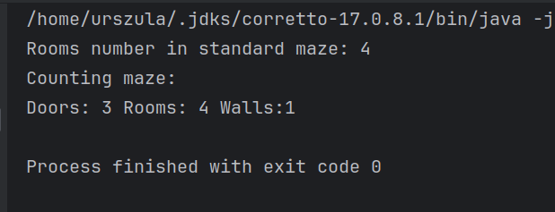
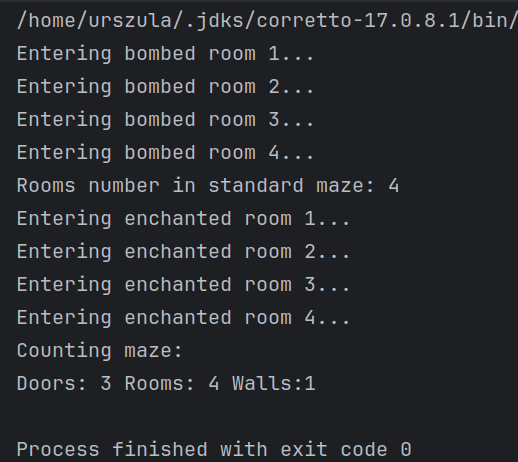
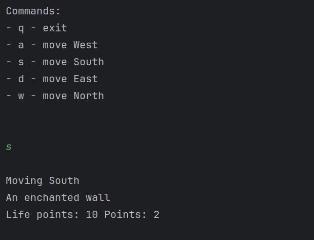
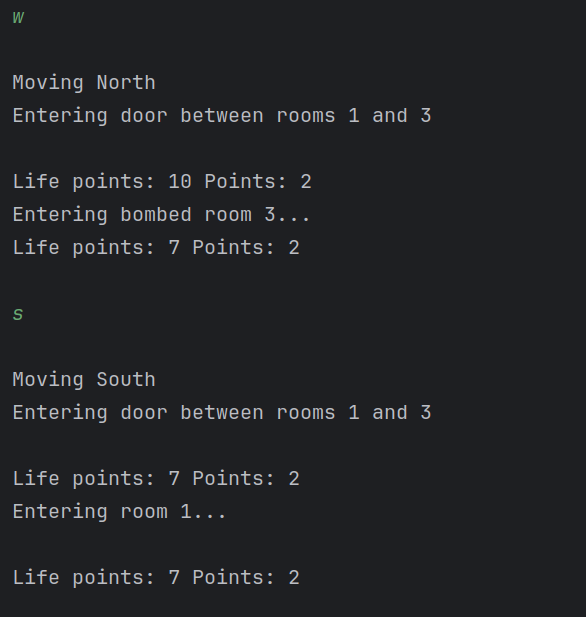
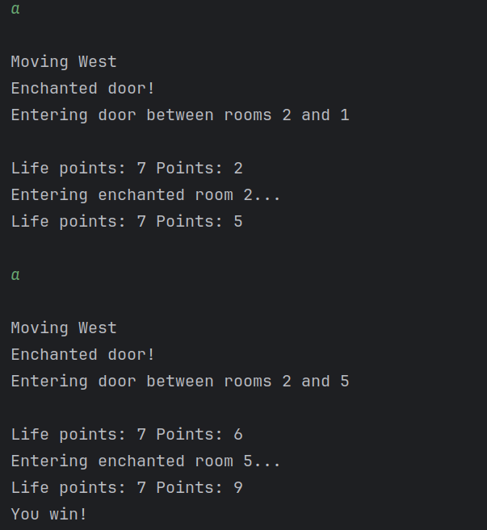
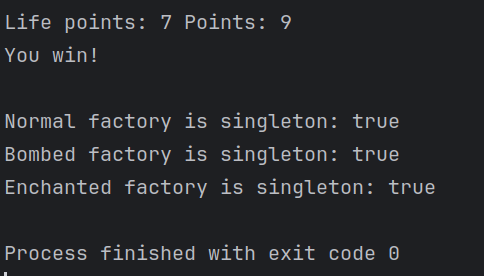

# Laboratorium 5: Wzorce projektowe
*Autor: Urszula Stankiewicz*

# 1) Builder

Tworzę interfejs `Maze Builder` z dwoma defaultowymi metodami, które przydadzą się później:   
- `default Direction getOppositeDirection(Direction direction)` - zwraca przeciwny kierunek do podanego
- `default Direction commonWall(Room room1, Room room2)` - zwraca wspólną ścianę dwóch pokoi, jeśli pokoje ze sobą nie sąsiadują, rzuca `IllegalArgumentException`


Sam interfejs wygląda następująco:
```java
package pl.agh.edu.dp.labirynth.builder;

import pl.agh.edu.dp.labirynth.*;

public interface MazeBuilder {
    void addRoom(Room room);

    void setRoomWall(Room room, Direction direction, Wall wall);

    void joinRoomsWithAWall(Room room1, Room room2, Direction direction1);

    void addDoor(Room room1, Room room2);

    default Direction getOppositeDirection(Direction direction) {
        return switch (direction) {
            case East -> Direction.West;
            case West -> Direction.East;
            case North -> Direction.South;
            case South -> Direction.North;
        };
    }

    default Direction commonWall(Room room1, Room room2) {
        for (Direction direction : Direction.values()) {
            Direction oppositeDirection = getOppositeDirection(direction);
            if (room1.getSide(direction).equals(room2.getSide(oppositeDirection))) {
                return direction;
            }
        }
        throw new IllegalArgumentException("Rooms don't have common wall!");
    }
}
```

Tworzę klasę `StandardMazeBuilder`, będącą implementacją powyższego interfejsu. Dodaję metodę build, która zwróci nowy obiekt klasy Maze o parametrach ustawionych w builderze:


```java
package pl.agh.edu.dp.labirynth.builder;

import pl.agh.edu.dp.labirynth.*;

import java.util.*;

public class StandardMazeBuilder implements MazeBuilder {
    Vector<Room> rooms=new Vector<>();

    @Override
    public void addRoom(Room room) {
        rooms.add(room);
    }

    @Override
    public void setRoomWall(Room room, Direction direction, Wall wall) {
        if(!rooms.contains(room)){
            throw  new IllegalArgumentException("No such room in your map, first add it!");
        }
        room.setSide(direction,wall);
    }

    @Override
    public void joinRoomsWithAWall(Room room1, Room room2, Direction direction1) {
        Wall wall=new Wall();
        room2.setSide(getOppositeDirection(direction1),wall);
        room1.setSide(direction1,wall);
    }

    @Override
    public void addDoor(Room room1, Room room2) {
        Door door=new Door(room1, room2);

        Direction room1Direction=commonWall(room1,room2);
        Direction room2Direction=getOppositeDirection(room1Direction);

        room1.setSide(room1Direction,door);
        room2.setSide(room2Direction,door);
    }


    public List<Room> getRooms() {
        return rooms;
    }

    public Maze build(){
        return new Maze(rooms);
    }


}
```

Tworzę też klasę `CountingMazeBuilder`, która jest inną implementacją interfejsu. Tym razem jednak nie posiada ona metodu build zwracającej obiekt labiryntu, a jedynie metodę getCounts, która zwraca statystyki dotyczące liczby pokoi, ścian i drzwi w labiryncie. Statystyki te są zwracane w formie nowego obiektu klasy Counter. Klasy `CountingMazeBuilder` oraz `Counter` przedstawiam poniżej:

```java
package pl.agh.edu.dp.labirynth.builder;

import pl.agh.edu.dp.labirynth.*;

import java.util.*;

public class CountingMazeBuilder implements MazeBuilder{
    private Set<MapSite> walls=new HashSet<>();
    private Set<MapSite> rooms=new HashSet<>();
    private Set<MapSite> doors=new HashSet<>();

    @Override
    public void addRoom(Room room) {
        rooms.add(room);
    }

    @Override
    public void setRoomWall(Room room, Direction direction, Wall wall) {
        if(!rooms.contains(room)){
            throw new IllegalArgumentException("No such room!");
        }
        doors.remove(room.getSide(direction));
        walls.remove(room.getSide(direction));
        room.setSide(direction,wall);
        walls.add(wall);


    }

    @Override
    public void joinRoomsWithAWall(Room room1, Room room2, Direction direction1) {
        if(!rooms.contains(room1) || !rooms.contains(room2)){
            throw new IllegalArgumentException("No such room!");
        }


        doors.remove(room1.getSide(direction1));
        doors.remove(room2.getSide(getOppositeDirection(direction1)));
        walls.remove(room1.getSide(direction1));
        walls.remove(room2.getSide(getOppositeDirection(direction1)));

        Wall wall=new Wall();
        room2.setSide(getOppositeDirection(direction1),wall);
        room1.setSide(direction1,wall);
        walls.add(room1.getSide(direction1));

    }

    @Override
    public void addDoor(Room room1, Room room2) {
        if(!rooms.contains(room1) || !rooms.contains(room2)){
            throw new IllegalArgumentException("No such room!");
        }

        Direction room1Direction=commonWall(room1,room2);

        walls.remove(room1.getSide(room1Direction));
        walls.remove(room2.getSide(getOppositeDirection(room1Direction)));
        doors.add(new Door(room1,room2));

    }

    public Counter getCounts() {
        return new Counter(doors.size(),walls.size(),rooms.size());
    }


}


```

```java
package pl.agh.edu.dp.labirynth.builder;

public class Counter {
    private int doors;
    private int walls;
    private int rooms;

    public Counter(int doors, int walls, int rooms) {
        this.doors = doors;
        this.walls = walls;
        this.rooms = rooms;
    }


    public int getDoors(){
        return doors;
    }

    public int getWalls(){
        return walls;
    }

    public int getRooms(){
        return rooms;
    }
    
}

```

Ponadto dodaję klasę dyrektora, która utworzy przykładowe labirynty obu typów:

```java
package pl.agh.edu.dp.labirynth.builder;

import pl.agh.edu.dp.labirynth.Direction;
import pl.agh.edu.dp.labirynth.Maze;
import pl.agh.edu.dp.labirynth.Room;
import pl.agh.edu.dp.labirynth.Wall;

public class MazeDirector {

    public Maze createExampleMaze(StandardMazeBuilder builder){
        prepareExampleMaze(builder);

        return builder.build();

    }

    public Counter createExampleCountingMaze(CountingMazeBuilder builder){
        prepareExampleMaze(builder);
        return builder.getCounts();
    }

    private void prepareExampleMaze(MazeBuilder builder){
        Room room1=new Room(1);
        Room room2=new Room(2);
        Room room3=new Room(3);
        Room room4=new Room(4);

        builder.addRoom(room1);
        builder.addRoom(room2);
        builder.addRoom(room3);
        builder.addRoom(room4);


        builder.setRoomWall(room1, Direction.North,new Wall());
        builder.setRoomWall(room1, Direction.West,new Wall());
        builder.setRoomWall(room2, Direction.North,new Wall());
        builder.setRoomWall(room2, Direction.East,new Wall());

        builder.setRoomWall(room3, Direction.South,new Wall());
        builder.setRoomWall(room3, Direction.West,new Wall());
        builder.setRoomWall(room4, Direction.South,new Wall());
        builder.setRoomWall(room4, Direction.East,new Wall());

        builder.joinRoomsWithAWall(room1,room2, Direction.West);
        builder.joinRoomsWithAWall(room1,room3, Direction.North);
        builder.joinRoomsWithAWall(room2,room4, Direction.North);
        builder.joinRoomsWithAWall(room3,room4,Direction.West);

        builder.addDoor(room4,room2);
        builder.addDoor(room2,room1);
        builder.addDoor(room1,room3);
    }
}

```

Modyfikuję klasę MazeGame:

```java

package pl.agh.edu.dp.labirynth;

import pl.agh.edu.dp.labirynth.builder.Counter;
import pl.agh.edu.dp.labirynth.builder.CountingMazeBuilder;
import pl.agh.edu.dp.labirynth.builder.MazeDirector;
import pl.agh.edu.dp.labirynth.builder.StandardMazeBuilder;

public class MazeGame {
    public Maze createMaze(StandardMazeBuilder builder){
        MazeDirector director=new MazeDirector();
        return director.createExampleMaze(builder);
    }

    public Counter createCountingMaze(CountingMazeBuilder builder){
        MazeDirector director=new MazeDirector();
        return director.createExampleCountingMaze(builder);
    }
}

```

W klasie Main testuję program:
```java
package pl.agh.edu.dp.main;

import pl.agh.edu.dp.labirynth.*;
import pl.agh.edu.dp.labirynth.builder.Counter;
import pl.agh.edu.dp.labirynth.builder.CountingMazeBuilder;
import pl.agh.edu.dp.labirynth.builder.StandardMazeBuilder;

public class Main {

    public static void main(String[] args) {

        MazeGame mazeGame = new MazeGame();
        StandardMazeBuilder builder = new StandardMazeBuilder();
        Maze maze = mazeGame.createMaze(builder);

        System.out.println("Rooms number in standard maze: " + maze.getRoomNumbers());

        CountingMazeBuilder countingMazeBuilder = new CountingMazeBuilder();
        Counter counter = mazeGame.createCountingMaze(countingMazeBuilder);

        System.out.println("Counting maze:");
        System.out.println("Doors: " + counter.getDoors() + " Rooms: " + counter.getRooms() + " Walls:" + counter.getWalls());
    }
}


```
Otrzymuję poprawne wyniki:   


# 2) Fabryka abstrakcyjna
Najpierw zmieniam nieco strukturę: uznałam, że klasa Counter powinna też być labiryntem, żeby builder miałm sens, dlatego przekształciłam tą klasę w CountingMaze, która dziedziczy po Maze:

```java
package pl.agh.edu.dp.labirynth.maze;

public class CountingMaze extends Maze {
    private int doors;
    private int walls;
    private int rooms;

    public CountingMaze(int doors, int walls, int rooms) {
        this.doors = doors;
        this.walls = walls;
        this.rooms = rooms;
    }


    public int getDoorNumber(){
        return doors;
    }

    public int getWallNumber(){
        return walls;
    }

    public int getRoomNumber(){
        return rooms;
    }
    
}

```

By ujednolicić, metodę getCounts() klasy CountinMazeBuilder przemianowałam na build():
```java
    public Maze build() {
        return new CountingMaze(doors.size(),walls.size(),rooms.size());
    }

```
 Jest teraz tak samo jak w StandardMazeBuilder, więc mogę dodać metodę `Maze build()` do interfejsu `MazeBuilder`:
 ```java
 package pl.agh.edu.dp.labirynth.builder;

import pl.agh.edu.dp.labirynth.Direction;
import pl.agh.edu.dp.labirynth.maze.Maze;
import pl.agh.edu.dp.labirynth.model.Room;
import pl.agh.edu.dp.labirynth.model.Wall;
import pl.agh.edu.dp.labirynth.factory.MazeFactory;

public interface MazeBuilder {
    void addRoom(Room room);

    void setRoomWall(Room room, Direction direction, Wall wall);

    void joinRoomsWithAWall(Room room1, Room room2, Direction direction1, Wall wall);

    void addDoor(Room room1, Room room2, MazeFactory mazeFactory);
    Maze build();

    default Direction getOppositeDirection(Direction direction) {
        return switch (direction) {
            case East -> Direction.West;
            case West -> Direction.East;
            case North -> Direction.South;
            case South -> Direction.North;
        };
    }

    default Direction commonWall(Room room1, Room room2) {
        for (Direction direction : Direction.values()) {
            Direction oppositeDirection = getOppositeDirection(direction);
            if (room1.getSide(direction) != null && room2.getSide(oppositeDirection) != null && room1.getSide(direction).equals(room2.getSide(oppositeDirection))) {
                return direction;
            }
        }
        throw new IllegalArgumentException("Rooms don't have common wall!");
    }
}

```
Tworzę interfejs `MazeFactory`:  
```java

package pl.agh.edu.dp.labirynth.factory;

import pl.agh.edu.dp.labirynth.model.Door;
import pl.agh.edu.dp.labirynth.model.Room;
import pl.agh.edu.dp.labirynth.model.Wall;

public interface MazeFactory {
    Room createRoom(int num);
    Wall createWall();
    Door createDoor(Room room1, Room room2);
}
```
Oraz implementujące go klasy `BombedMazeFactory` oraz `EnchantedMazeFactory`:

```java
package pl.agh.edu.dp.labirynth.factory;

import pl.agh.edu.dp.labirynth.model.Door;
import pl.agh.edu.dp.labirynth.model.Room;
import pl.agh.edu.dp.labirynth.model.Wall;
import pl.agh.edu.dp.labirynth.model.bombed.BombedDoor;
import pl.agh.edu.dp.labirynth.model.bombed.BombedRoom;
import pl.agh.edu.dp.labirynth.model.bombed.BombedWall;

public class BombedMazeFactory implements MazeFactory{
    @Override
    public Room createRoom(int num) {
        return new BombedRoom(num);
    }

    @Override
    public Wall createWall() {
        return new BombedWall();
    }

    @Override
    public Door createDoor(Room room1, Room room2) {
        return new BombedDoor(room1,room2);
    }
}
package pl.agh.edu.dp.labirynth.factory;

import pl.agh.edu.dp.labirynth.model.Door;
import pl.agh.edu.dp.labirynth.model.Room;
import pl.agh.edu.dp.labirynth.model.Wall;
import pl.agh.edu.dp.labirynth.model.enchanted.EnchantedDoor;
import pl.agh.edu.dp.labirynth.model.enchanted.EnchantedRoom;
import pl.agh.edu.dp.labirynth.model.enchanted.EnchantedWall;

public class EnchantedMazeFactory implements MazeFactory{
    @Override
    public Room createRoom(int num) {
        return new EnchantedRoom(num);
    }

    @Override
    public Wall createWall() {
        return new EnchantedWall();
    }

    @Override
    public Door createDoor(Room room1, Room room2) {
        return new EnchantedDoor(room1,room2);
    }
}
```

Klasy te zwracają instancje następujących klas rozszerzających odpowiednio klasy Door, Wall, Room:
- Bombed
```java
package pl.agh.edu.dp.labirynth.model.bombed;

import pl.agh.edu.dp.labirynth.model.Door;
import pl.agh.edu.dp.labirynth.model.Room;

public class BombedDoor extends Door {
    public BombedDoor(Room r1, Room r2) {
        super(r1, r2);
    }

    @Override
    public void Enter(){
        System.out.println("Entering bombed door between rooms "+room1.getRoomNumber()+" and "+room2.getRoomNumber());
    }
}
package pl.agh.edu.dp.labirynth.model.bombed;

import pl.agh.edu.dp.labirynth.model.Room;

public class BombedRoom extends Room {
    public BombedRoom(int number) {
        super(number);
    }

    @Override
    public void Enter(){
        System.out.println("Entering bombed room "+getRoomNumber()+"...");
    }
}
package pl.agh.edu.dp.labirynth.model.bombed;

import pl.agh.edu.dp.labirynth.model.Wall;

public class BombedWall extends Wall {
    @Override
    public void Enter(){
        System.out.println("A bombed wall");
    }
}

```
- Enchanted:
```java
package pl.agh.edu.dp.labirynth.model.enchanted;

import pl.agh.edu.dp.labirynth.model.Door;
import pl.agh.edu.dp.labirynth.model.Room;

public class EnchantedDoor extends Door {

    public EnchantedDoor(Room r1, Room r2) {
        super(r1, r2);
    }

    @Override
    public void Enter(){
        System.out.println("Entering enchanted door between rooms "+room1.getRoomNumber()+" and "+room2.getRoomNumber());
    }


}
package pl.agh.edu.dp.labirynth.model.enchanted;

import pl.agh.edu.dp.labirynth.model.Room;

public class EnchantedRoom extends Room {

    public EnchantedRoom(int number) {
        super(number);
    }

    @Override
    public void Enter(){
        System.out.println("Entering enchanted room "+getRoomNumber()+"...");
    }
}
package pl.agh.edu.dp.labirynth.model.enchanted;

import pl.agh.edu.dp.labirynth.model.Wall;

public class EnchantedWall extends Wall {
    @Override
    public void Enter(){
        System.out.println("An enchanted wall");
    }
}
```
Uzupełniam też metody `Enter` klas podstawowych:
- Room:
    ```java
    @Override
    public void Enter(){
        System.out.println("Entering room "+getRoomNumber()+"...");
    }
    ```
- Wall 
    ```java
    @Override
    public void Enter(){
        System.out.println("A wall");
    }
    ```
- Door
    ```java
    @Override
    public void Enter(){
        System.out.println("Entering door between rooms "+room1.getRoomNumber()+" and "+room2.getRoomNumber());

    }
    ```
Po zmianach klasy Counter na CountingMaze możemy znacznie uprościć klasę `MazeDirector`. Dodatkowo dodajemy do jej metody parametr `MazeFactory`, który pozwoli nam stworzyć przykładowy labirynt konkretnego typu:
```java
package pl.agh.edu.dp.labirynth.builder;

import pl.agh.edu.dp.labirynth.Direction;
import pl.agh.edu.dp.labirynth.maze.CountingMaze;
import pl.agh.edu.dp.labirynth.maze.Maze;
import pl.agh.edu.dp.labirynth.model.Room;
import pl.agh.edu.dp.labirynth.factory.MazeFactory;

public class MazeDirector {

    public Maze createExampleMaze(MazeBuilder builder, MazeFactory mazeFactory){
        prepareExampleMaze(builder,mazeFactory);
        return builder.build();

    }

    private void prepareExampleMaze(MazeBuilder builder, MazeFactory mazeFactory){
        Room room1=mazeFactory.createRoom(1);
        Room room2=mazeFactory.createRoom(2);
        Room room3=mazeFactory.createRoom(3);
        Room room4=mazeFactory.createRoom(4);

        builder.addRoom(room1);
        builder.addRoom(room2);
        builder.addRoom(room3);
        builder.addRoom(room4);


        builder.setRoomWall(room1, Direction.North,mazeFactory.createWall());
        builder.setRoomWall(room1, Direction.West,mazeFactory.createWall());
        builder.setRoomWall(room2, Direction.North,mazeFactory.createWall());
        builder.setRoomWall(room2, Direction.East,mazeFactory.createWall());

        builder.setRoomWall(room3, Direction.South,mazeFactory.createWall());
        builder.setRoomWall(room3, Direction.West,mazeFactory.createWall());
        builder.setRoomWall(room4, Direction.South,mazeFactory.createWall());
        builder.setRoomWall(room4, Direction.East,mazeFactory.createWall());

        builder.joinRoomsWithAWall(room1,room2, Direction.West,mazeFactory.createWall());
        builder.joinRoomsWithAWall(room1,room3, Direction.North,mazeFactory.createWall());
        builder.joinRoomsWithAWall(room2,room4, Direction.North,mazeFactory.createWall());
        builder.joinRoomsWithAWall(room3,room4,Direction.West,mazeFactory.createWall());

        builder.addDoor(room4,room2,mazeFactory);
        builder.addDoor(room2,room1,mazeFactory);
        builder.addDoor(room1,room3,mazeFactory);
    }
}
```
Klasa `MazeGame` także ulega uproszczeniu:
```java
package pl.agh.edu.dp.labirynth;

import pl.agh.edu.dp.labirynth.builder.*;
import pl.agh.edu.dp.labirynth.factory.MazeFactory;
import pl.agh.edu.dp.labirynth.maze.Maze;

public class MazeGame {
    public Maze createMaze(MazeBuilder builder, MazeFactory mazeFactory){
        MazeDirector director=new MazeDirector();
        return director.createExampleMaze(builder,mazeFactory);
    }


}
```
Klasę Main natomiast modyfikuję następująco w celu przetestowania rozwiązań (Najpierw tworze dwa standardowe labirynty - jeden Bombed, drugi Enchanted i wchodzę do ich wszystkich pokoi, printuję liczbę pokoi w labiryncie, a następnie tworzę CountingMaze i printuję statystyki):
```java
package pl.agh.edu.dp.main;

import pl.agh.edu.dp.labirynth.*;
import pl.agh.edu.dp.labirynth.maze.CountingMaze;
import pl.agh.edu.dp.labirynth.builder.CountingMazeBuilder;
import pl.agh.edu.dp.labirynth.builder.StandardMazeBuilder;
import pl.agh.edu.dp.labirynth.factory.BombedMazeFactory;
import pl.agh.edu.dp.labirynth.factory.EnchantedMazeFactory;
import pl.agh.edu.dp.labirynth.factory.MazeFactory;
import pl.agh.edu.dp.labirynth.maze.Maze;
import pl.agh.edu.dp.labirynth.model.Room;

public class Main {

    public static void main(String[] args) {

        MazeGame mazeGame = new MazeGame();
        StandardMazeBuilder builder = new StandardMazeBuilder();
        MazeFactory mazeFactory=new BombedMazeFactory();
        Maze maze = mazeGame.createMaze(builder,mazeFactory);

        for(Room room : maze.getRooms()){
            room.Enter();
        }


        System.out.println("Rooms number in standard maze: " + maze.getRoomNumbers());

        mazeFactory=new EnchantedMazeFactory();
        maze = mazeGame.createMaze(new StandardMazeBuilder(),mazeFactory);

        for(Room room : maze.getRooms()){
            room.Enter();
        }

        CountingMazeBuilder countingMazeBuilder = new CountingMazeBuilder();
        CountingMaze counter = (CountingMaze) mazeGame.createMaze(countingMazeBuilder, mazeFactory);

        System.out.println("Counting maze:");
        System.out.println("Doors: " + counter.getDoorNumber() + " Rooms: " + counter.getRoomNumber() + " Walls:" + counter.getWallNumber());
    }
}

```
Otrzymuję następujące wyniki:    


# 3) Singleton

Stworzenie singletonu interfejsu jest niemożliwe, ponieważ nie możemy tworzyć instancji interfejsu, dlatego tworzę singletony podklas BombedMazeFactory i EnchantedMazeFactory:

```java
package pl.agh.edu.dp.labirynth.factory;

import pl.agh.edu.dp.labirynth.model.Door;
import pl.agh.edu.dp.labirynth.model.Room;
import pl.agh.edu.dp.labirynth.model.Wall;
import pl.agh.edu.dp.labirynth.model.bombed.BombedDoor;
import pl.agh.edu.dp.labirynth.model.bombed.BombedRoom;
import pl.agh.edu.dp.labirynth.model.bombed.BombedWall;

public class BombedMazeFactory implements MazeFactory{
    private static BombedMazeFactory instance;
    private BombedMazeFactory(){

    }

    public static BombedMazeFactory getInstance() {
        if (instance == null) {
            instance = new BombedMazeFactory() ;

        }
        return instance;
    }
    @Override
    public Room createRoom(int num) {
        return new BombedRoom(num);
    }

    @Override
    public Wall createWall() {
        return new BombedWall();
    }

    @Override
    public Door createDoor(Room room1, Room room2) {
        return new BombedDoor(room1,room2);
    }
}
package pl.agh.edu.dp.labirynth.factory;

import pl.agh.edu.dp.labirynth.model.Door;
import pl.agh.edu.dp.labirynth.model.Room;
import pl.agh.edu.dp.labirynth.model.Wall;
import pl.agh.edu.dp.labirynth.model.enchanted.EnchantedDoor;
import pl.agh.edu.dp.labirynth.model.enchanted.EnchantedRoom;
import pl.agh.edu.dp.labirynth.model.enchanted.EnchantedWall;

public class EnchantedMazeFactory implements MazeFactory{
    private static EnchantedMazeFactory instance;
    private EnchantedMazeFactory(){

    }

    public static EnchantedMazeFactory getInstance() {
        if (instance == null) {
            instance = new EnchantedMazeFactory() ;

        }
        return instance;
    }

    @Override
    public Room createRoom(int num) {
        return new EnchantedRoom(num);
    }

    @Override
    public Wall createWall() {
        return new EnchantedWall();
    }

    @Override
    public Door createDoor(Room room1, Room room2) {
        return new EnchantedDoor(room1,room2);
    }
}


```

# 4) Player
 Wprowadzam klasę `Player`:
 ```java
package pl.agh.edu.dp.labirynth;

import pl.agh.edu.dp.labirynth.model.Room;

public class Player {
    private int life = 10;
    private int points = 0;
    private Room currentRoom;

    public Player(Room room) {
        currentRoom = room;
    }

    public int getLife() {
        return life;
    }

    public int getPoints() {
        return points;
    }

    public void setCurrentRoom(Room currentRoom) {
        this.currentRoom = currentRoom;
    }

    public void decreaseLife(int val) {
        life -= val;
    }

    public void increaseLife(int val) {
        life += val;
    }

    public void increasePoints(int val) {
        points += val;
    }

    public boolean isDead() {
        return life <= 0;
    }

    public Room getCurrentRoom() {
        return currentRoom;
    }

    @Override
    public String toString() {
        return ("Life points: " + getLife() + " Points: " + getPoints());
    }

}

 ```

 Modyfikuję też klasę MazeGame:
 - wprowadzam metodę checkSingletons, która sprawdza czy wszystkie fabryki są singletonami
 - metoda startGame dla danego labiryntu tworzy gracza i obsługuje jego ruch w labiryncie. Jeśli parametr life gracza spadnie do zera, gracz przegrywa. Jeśli natomiast zdobędzie przynajmniej 10 punktów - wygrywa. Jeśli przez 10 sekund nie wprowadzi komendy, traci 5 punktów życia. Poruszać się po labiryncie można klawiszami a,w,s,d:
   - a - na zachód
   - w - na północ
   - s - na południe
   - d - na wschód
   W celu zakończenia gry należy wprowadzić 'q'
```java
package pl.agh.edu.dp.labirynth;

import pl.agh.edu.dp.labirynth.builder.MazeBuilder;
import pl.agh.edu.dp.labirynth.builder.MazeDirector;
import pl.agh.edu.dp.labirynth.factory.BombedMazeFactory;
import pl.agh.edu.dp.labirynth.factory.EnchantedMazeFactory;
import pl.agh.edu.dp.labirynth.factory.MazeFactory;
import pl.agh.edu.dp.labirynth.factory.NormalMazeFactory;
import pl.agh.edu.dp.labirynth.maze.Maze;
import pl.agh.edu.dp.labirynth.model.MapSite;

import java.io.BufferedReader;
import java.io.IOException;
import java.io.InputStreamReader;
import java.util.concurrent.*;

public class MazeGame {
    public Maze createRandomizedMaze(MazeBuilder builder, MazeFactory mazeFactory) {
        MazeDirector director = new MazeDirector();
        return director.createRandomizedMaze();
    }

    public void checkSingleton() {
        MazeFactory mazeFactory = NormalMazeFactory.getInstance();
        System.out.println("Normal factory is singleton: " + mazeFactory.equals(NormalMazeFactory.getInstance()));

        mazeFactory = BombedMazeFactory.getInstance();
        System.out.println("Bombed factory is singleton: " + mazeFactory.equals(BombedMazeFactory.getInstance()));

        mazeFactory = EnchantedMazeFactory.getInstance();
        System.out.println("Enchanted factory is singleton: " + mazeFactory.equals(EnchantedMazeFactory.getInstance()));

    }

    public void startGame(Maze maze) {
        System.out.println("""
                Commands:
                - q - exit
                - a - move West
                - s - move South
                - d - move East
                - w - move North
                """);
        Player player = new Player(maze.getStartRoom());
        ExecutorService executor = Executors.newSingleThreadExecutor();
        try {
            while (true) {

                System.out.println();
                Future<String> future = executor.submit(new InputReaderTask());
                String input = null;
                try {
                    input = future.get(10, TimeUnit.SECONDS);
                } catch (TimeoutException e) {
                    System.out.println("Timeout: No input received within 10 seconds, player's damaged -5LP");
                    player.decreaseLife(5);
                    future.cancel(true); // Cancel the task if it's still running
                }
                System.out.println();
                if (input != null) {
                    if (input.equals("q")) return;
                    MapSite mapSite = switch (input) {
                        case "w" -> {
                            System.out.println("Moving North");
                            yield player.getCurrentRoom().getSide(Direction.North);
                        }
                        case "s" -> {
                            System.out.println("Moving South");
                            yield player.getCurrentRoom().getSide(Direction.South);
                        }
                        case "a" -> {
                            System.out.println("Moving West");
                            yield player.getCurrentRoom().getSide(Direction.West);
                        }
                        case "d" -> {
                            System.out.println("Moving East");
                            yield player.getCurrentRoom().getSide(Direction.East);
                        }
                        default -> {
                            System.out.println("No such option!");
                            yield null;
                        }

                    };
                    if (mapSite == null) {
                        System.out.println("Nothing there!");
                    } else {
                        mapSite.Enter(player);
                    }
                }
                if (player.isDead()) {
                    System.out.println("Your life points are 0, you lose");
                    break;
                }
                if (player.getPoints() >= 10) {
                    System.out.println("You win!");
                    break;
                }
            }

        } catch (InterruptedException | ExecutionException e) {
            e.printStackTrace();
        } finally {
            executor.shutdownNow();
        }
    }

    static class InputReaderTask implements Callable<String> {
        @Override
        public String call() throws IOException {
            var reader = new BufferedReader(new InputStreamReader(System.in));
            return reader.readLine();
        }
    }


}

```

Zmodyfikowałam też metody Enter wszystkich komponentów mapy:
```java

public class Door extends MapSite {
    protected Room room1;
    protected Room room2;

    public Door(Room r1, Room r2) {
        this.room1 = r1;
        this.room2 = r2;
    }


    @Override
    public void Enter(Player player) {
        System.out.println("Entering door between rooms " + room1.getRoomNumber() + " and " + room2.getRoomNumber() + "\n");
        System.out.println(player);
        if (player.getCurrentRoom().equals(getRoom1())) {
            player.setCurrentRoom(getRoom2());

        } else {
            player.setCurrentRoom(getRoom1());

        }
        player.getCurrentRoom().Enter(player);
    }

    public Room getRoom1() {
        return room1;
    }

    public void setRoom1(Room room1) {
        this.room1 = room1;
    }

    public Room getRoom2() {
        return room2;
    }

    public void setRoom2(Room room2) {
        this.room1 = room2;
    }
}

public class Room extends MapSite {
    private int roomNumber;
    private Map<Direction, MapSite> sides;


    public Room(int number) {
        this.sides = new EnumMap<>(Direction.class);
        this.roomNumber = number;
    }

    public MapSite getSide(Direction direction) {
        return this.sides.get(direction);
    }

    public void setSide(Direction direction, MapSite ms) {
        this.sides.put(direction, ms);
    }

    public int getRoomNumber() {
        return this.roomNumber;
    }

    @Override
    public void Enter(Player player) {
        System.out.println("Entering room " + getRoomNumber() + "...\n");
        System.out.println(player);

    }
}


public class Wall extends MapSite {
    public Wall() {

    }

    @Override
    public void Enter(Player player) {
        System.out.println("A wall\n");
        System.out.println(player);

    }
}


public class EnchantedDoor extends Door {

    public EnchantedDoor(Room r1, Room r2) {
        super(r1, r2);
    }

    @Override
    public void Enter(Player player) {
        System.out.println("Enchanted door!");
        super.Enter(player);
        player.increasePoints(1);
    }


}

public class EnchantedRoom extends Room {

    public EnchantedRoom(int number) {
        super(number);
    }

    @Override
    public void Enter(Player player) {
        System.out.println("Entering enchanted room " + getRoomNumber() + "...");
        player.increasePoints(3);
        System.out.println(player);
    }
}

public class EnchantedWall extends Wall {
    @Override
    public void Enter(Player player) {
        System.out.println("An enchanted wall");
        player.increasePoints(2);
        System.out.println(player);
    }
}

public class BombedDoor extends Door {
    public BombedDoor(Room r1, Room r2) {
        super(r1, r2);
    }

    @Override
    public void Enter(Player player) {
        System.out.println("Bombed door!");
        super.Enter(player);
        player.decreaseLife(1);


    }
}

public class BombedRoom extends Room {
    public BombedRoom(int number) {
        super(number);
    }

    @Override
    public void Enter(Player player) {
        System.out.println("Entering bombed room " + getRoomNumber() + "...");
        player.decreaseLife(3);
        System.out.println(player);
    }
}

public class BombedWall extends Wall {
    @Override
    public void Enter(Player player) {
        System.out.println("A bombed wall");
        player.decreaseLife(2);
        System.out.println(player);
    }
}
```

Jak widać, wejście do zwykłego pokoju / przejście przez drzwi albo wejście na ścianę nie daje efektu w przypadku zwykłych komponentów. Natomiast w przypadku komponentów typu Enchanted:
- przejście przez drzwi +1 punkt zwycięstwa
- wejście na ścianę +2 punkty zwycięstwa
- wejście do pokoju +3 punkty zwycięstwa
A w przypadku komponentów typu Bombed:
- przejście przez drzwi -1 punkt życia
- wejście na ścianę -2 punkty życia
- wejście do pokoju -3 punkty życia

Wprowadzam też fabrykę `NormalMazeFactory`, która będzie produkować instancje klas bazowych Room, Wall oraz Door:
```java
package pl.agh.edu.dp.labirynth.factory;

import pl.agh.edu.dp.labirynth.model.Door;
import pl.agh.edu.dp.labirynth.model.Room;
import pl.agh.edu.dp.labirynth.model.Wall;


public class NormalMazeFactory implements MazeFactory {
    private static NormalMazeFactory instance;

    private NormalMazeFactory() {

    }

    public static NormalMazeFactory getInstance() {
        if (instance == null) {
            instance = new NormalMazeFactory();

        }
        return instance;
    }

    @Override
    public Room createRoom(int num) {
        return new Room(num);
    }

    @Override
    public Wall createWall() {
        return new Wall();
    }

    @Override
    public Door createDoor(Room room1, Room room2) {
        return new Door(room1, room2);
    }
}

```
Oraz dodaję do klasy `MazeDirector` nową metodę `Maze createRandomizedMaze()`, która stworzy przykładowy labirynt złożony z komponentów różnych typów, co urozmaici grę:

```java
package pl.agh.edu.dp.labirynth.builder;

import pl.agh.edu.dp.labirynth.Direction;
import pl.agh.edu.dp.labirynth.factory.BombedMazeFactory;
import pl.agh.edu.dp.labirynth.factory.EnchantedMazeFactory;
import pl.agh.edu.dp.labirynth.factory.MazeFactory;
import pl.agh.edu.dp.labirynth.factory.NormalMazeFactory;
import pl.agh.edu.dp.labirynth.maze.Maze;
import pl.agh.edu.dp.labirynth.model.Room;

public class MazeDirector {

    public Maze createExampleMaze(MazeBuilder builder, MazeFactory mazeFactory) {
        prepareExampleMaze(builder, mazeFactory);
        return builder.build();

    }

    private void prepareExampleMaze(MazeBuilder builder, MazeFactory mazeFactory) {
        Room room1 = mazeFactory.createRoom(1);
        Room room2 = mazeFactory.createRoom(2);
        Room room3 = mazeFactory.createRoom(3);
        Room room4 = mazeFactory.createRoom(4);

        builder.addRoom(room1);
        builder.addRoom(room2);
        builder.addRoom(room3);
        builder.addRoom(room4);


        builder.setRoomWall(room1, Direction.North, mazeFactory.createWall());
        builder.setRoomWall(room1, Direction.West, mazeFactory.createWall());
        builder.setRoomWall(room2, Direction.North, mazeFactory.createWall());
        builder.setRoomWall(room2, Direction.East, mazeFactory.createWall());

        builder.setRoomWall(room3, Direction.South, mazeFactory.createWall());
        builder.setRoomWall(room3, Direction.West, mazeFactory.createWall());
        builder.setRoomWall(room4, Direction.South, mazeFactory.createWall());
        builder.setRoomWall(room4, Direction.East, mazeFactory.createWall());

        builder.joinRoomsWithAWall(room1, room2, Direction.West, mazeFactory.createWall());
        builder.joinRoomsWithAWall(room1, room3, Direction.North, mazeFactory.createWall());
        builder.joinRoomsWithAWall(room2, room4, Direction.North, mazeFactory.createWall());
        builder.joinRoomsWithAWall(room3, room4, Direction.West, mazeFactory.createWall());

        builder.addDoor(room4, room2, mazeFactory);
        builder.addDoor(room2, room1, mazeFactory);
        builder.addDoor(room1, room3, mazeFactory);
    }

    public Maze createRandomizedMaze() {
        StandardMazeBuilder builder = new StandardMazeBuilder();
        NormalMazeFactory normalMazeFactory = NormalMazeFactory.getInstance();
        EnchantedMazeFactory enchantedMazeFactory = EnchantedMazeFactory.getInstance();
        BombedMazeFactory bombedMazeFactory = BombedMazeFactory.getInstance();

        Room room1 = normalMazeFactory.createRoom(1);
        Room room2 = enchantedMazeFactory.createRoom(2);
        Room room3 = bombedMazeFactory.createRoom(3);
        Room room4 = bombedMazeFactory.createRoom(4);
        Room room5 = enchantedMazeFactory.createRoom(5);
        Room room6 = enchantedMazeFactory.createRoom(6);

        builder.addRoom(room1);
        builder.addRoom(room2);
        builder.addRoom(room3);
        builder.addRoom(room4);
        builder.addRoom(room5);
        builder.addRoom(room6);


        builder.setRoomWall(room1, Direction.South, enchantedMazeFactory.createWall());
        builder.setRoomWall(room1, Direction.East, bombedMazeFactory.createWall());
        builder.setRoomWall(room2, Direction.South, bombedMazeFactory.createWall());
        builder.setRoomWall(room5, Direction.West, bombedMazeFactory.createWall());

        builder.setRoomWall(room6, Direction.North, normalMazeFactory.createWall());
        builder.setRoomWall(room4, Direction.North, enchantedMazeFactory.createWall());


        builder.joinRoomsWithAWall(room1, room2, Direction.West, normalMazeFactory.createWall());
        builder.joinRoomsWithAWall(room1, room3, Direction.North, normalMazeFactory.createWall());
        builder.joinRoomsWithAWall(room2, room4, Direction.North, normalMazeFactory.createWall());
        builder.joinRoomsWithAWall(room3, room4, Direction.West, enchantedMazeFactory.createWall());
        builder.joinRoomsWithAWall(room2, room5, Direction.West, normalMazeFactory.createWall());
        builder.joinRoomsWithAWall(room4, room6, Direction.West, normalMazeFactory.createWall());
        builder.joinRoomsWithAWall(room6, room5, Direction.South, bombedMazeFactory.createWall());
        builder.joinRoomsWithAWall(room6, room3, Direction.West, bombedMazeFactory.createWall());

        builder.addDoor(room4, room2, normalMazeFactory);
        builder.addDoor(room2, room1, enchantedMazeFactory);
        builder.addDoor(room1, room3, normalMazeFactory);
        builder.addDoor(room4, room6, enchantedMazeFactory);
        builder.addDoor(room2, room5, enchantedMazeFactory);
        builder.addDoor(room6, room3, normalMazeFactory);

        return builder.build();
    }
}
```

Na koniec modyfikuję klasę Main tak, by najpierw rozpoczynała grę, a po jej zakończeniu sprawdzała, czy fabryki są singletonami:
```java
package pl.agh.edu.dp.main;

import pl.agh.edu.dp.labirynth.MazeGame;
import pl.agh.edu.dp.labirynth.builder.StandardMazeBuilder;
import pl.agh.edu.dp.labirynth.factory.BombedMazeFactory;
import pl.agh.edu.dp.labirynth.factory.MazeFactory;
import pl.agh.edu.dp.labirynth.maze.Maze;

import java.io.IOException;

public class Main {

    public static void main(String[] args) throws IOException {

        MazeGame mazeGame = new MazeGame();
        StandardMazeBuilder builder = new StandardMazeBuilder();
        MazeFactory mazeFactory = BombedMazeFactory.getInstance();
        Maze maze = mazeGame.createRandomizedMaze(builder, mazeFactory);

        mazeGame.startGame(maze);

        System.out.println();
        mazeGame.checkSingleton();
    }
}


```

Przykładowe wywołanie programu:   

   

   

   

   
