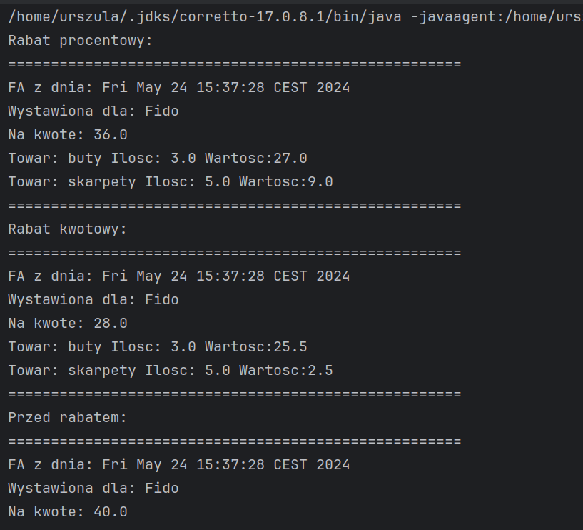

# Laboratorium 6 - Wzorce projektowe
*Autor: Urszula Stankiewicz*


# 1) Wzorzec strategia
Dodaję dwie klasy implementujące interfejs `ObliczCenePoRabacie`: `ObliczCenePoRabacieKwotowym` (zawiera atrybut `kwotaRabatu`, który stanowi kwotę, którą odejmiemy od ceny wyjściowej) oraz `ObliczCenePoRabacieProcentowym` (zawiera atrybut `procentRabatu`, który stanowi procent, przez który pomnożymy cenę wyjściową):
```java

package rabaty;

import static java.lang.Math.max;

public class ObliczCenePoRabacieKwotowym implements ObliczCenePoRabacie{

    private double kwotaRabatu;
    public ObliczCenePoRabacieKwotowym(double kwotaRabatu){
        this.kwotaRabatu=kwotaRabatu;
    }
    @Override
    public double obliczCenePoRabacie(double cena) {
        return max(cena-kwotaRabatu,0);
    }

    public double getKwotaRabatu() {
        return kwotaRabatu;
    }

    public void setKwotaRabatu(double kwotaRabatu) {
        this.kwotaRabatu = kwotaRabatu;
    }


}

package rabaty;

public class ObliczCenePoRabacieProcentowym implements ObliczCenePoRabacie{
    private double procentRabatu;
    public ObliczCenePoRabacieProcentowym(double procentRabatu){
        this.procentRabatu=procentRabatu;
    }
    @Override
    public double obliczCenePoRabacie(double cena) {
        return cena*procentRabatu;
    }

    public double getProcentRabatu() {
        return procentRabatu;
    }

    public void setProcentRabatu(double procentRabatu) {
        if(procentRabatu<0 || procentRabatu>1){
            throw new IllegalArgumentException("Procent rabatu musi być pomiędzy 0 a 1");
        }
        this.procentRabatu = procentRabatu;
    }
}


```

Dodatkowo w klasie `Faktura` dodaję prywatny atrybut `private ObliczCenePoRabacie strategiaObliczaniaRabatu;` oraz modyfikuję metodę `dodajPozycje` (prezentuję tylko zmodyfikowane fragmety):

```java
package dokumenty;

import java.util.ArrayList;
import java.util.Date;

import magazyn.KategoriaTowaru;
import magazyn.Towar;
import rabaty.ObliczCenePoRabacie;


public class Faktura {
    private Date dataSprzedazy;
    private String kontrahent;
    private ArrayList<Pozycja> pozycje;
    protected double suma;

    public Faktura(Date dataSprzedazy, String kontrahent) {
        this.dataSprzedazy = dataSprzedazy;
        this.kontrahent = kontrahent;
        pozycje = new ArrayList<Pozycja>();
        suma = 0;
    }

    public void dodajPozycje(KategoriaTowaru towar, double ilosc) {
        double nowaCena = strategiaObliczaniaRabatu.obliczCenePoRabacie(towar.getCena());
        Pozycja pozycja = new Pozycja(towar, ilosc);
        pozycja.setCena(nowaCena);
        pozycje.add(pozycja);

        this.przeliczSume();
    }

    public ObliczCenePoRabacie getStrategiaObliczaniaRabatu() {
        return strategiaObliczaniaRabatu;
    }

    public void setStrategiaObliczaniaRabatu(ObliczCenePoRabacie strategiaObliczaniaRabatu) {
        this.strategiaObliczaniaRabatu = strategiaObliczaniaRabatu;
    }

}


```

Modyfikuję też metodę main klasy `Ui` tak by w konstruktorze klasy `Faktura` używała przykładowego dodatkowego parametru `ObliczCenePoRabacie`:

```java

package main;

import java.util.Calendar;

import magazyn.KategoriaTowaru;

import dokumenty.Faktura;

//ZEWNETRZNY RABAT
import rabatlosowy.LosowyRabat;
import rabaty.ObliczCenePoRabacieProcentowym;


public class Ui {

    public static void main(String[] args) {
        Calendar teraz = Calendar.getInstance();

        //Tworzymy towary
        KategoriaTowaru t1 = new KategoriaTowaru(10, "buty");
        KategoriaTowaru t2 = new KategoriaTowaru(2, "skarpety");

        //I przykladowa fakture
        Faktura f = new Faktura(teraz.getTime(), "Fido", new ObliczCenePoRabacieProcentowym(0.9));
        f.dodajPozycje(t1, 3);
        f.dodajPozycje(t2, 5);

        wypiszFakture(f);


        //TEST ZEWN. rabatu
        LosowyRabat lr = new LosowyRabat();
        System.out.println(lr.losujRabat());
    }


}

```

Przykładowe wywołanie programu:    


# 2) Singleton

Dodaję będącą Singletonem klasę `Konfiguracja`, która posiada atrybut `private ObliczCenePoRabacie obliczanieRabatu;`, który odpowiada za konkretny skonfigurowany sposób naliczania rabatu.


```java
package main;

import rabaty.ObliczCenePoRabacie;

public class Konfiguracja {

    private static Konfiguracja instance;
    private ObliczCenePoRabacie obliczanieRabatu;

    private Konfiguracja(ObliczCenePoRabacie obliczanieRabatu){
        this.obliczanieRabatu=obliczanieRabatu;
    }

    private Konfiguracja(){
    }

    public static Konfiguracja getInstance(ObliczCenePoRabacie obliczanieRabatu){
        if(instance==null){
            instance=new Konfiguracja(obliczanieRabatu);
        }
        return instance;
    }

    public static Konfiguracja getInstance(){
        if(instance==null){
            instance=new Konfiguracja();
        }
        return instance;
    }

    public void setObliczanieRabatu(ObliczCenePoRabacie obliczanieRabatu) {
        this.obliczanieRabatu = obliczanieRabatu;
    }

    public ObliczCenePoRabacie getObliczanieRabatu(){
        return obliczanieRabatu;
    }
}


```

Modyfikuję ponownie klasę `Faktura` tak, by teraz posługiwała się konfiguracją w celu wyznaczania rabatów. Usuwam poprzedni atrybut `private ObliczCenePoRabacie strategiaObliczaniaRabatu;` oraz jego getter i setter:

```java
package dokumenty;

import java.util.ArrayList;
import java.util.Iterator;
import java.util.Date;

import magazyn.KategoriaTowaru;
import magazyn.Towar;
import main.Konfiguracja;
import rabaty.ObliczCenePoRabacie;


public class Faktura {
    private Date dataSprzedazy;
    private String kontrahent;
    private ArrayList<Pozycja> pozycje;
    protected double suma;

    public Faktura(Date dataSprzedazy, String kontrahent) {
        this.dataSprzedazy = dataSprzedazy;
        this.kontrahent = kontrahent;
        pozycje = new ArrayList<Pozycja>();
        suma = 0;
    }

    public void dodajPozycje(KategoriaTowaru towar, double ilosc) {
        ObliczCenePoRabacie obliczCenePoRabacie = Konfiguracja.getInstance().getObliczanieRabatu();
        if (obliczCenePoRabacie == null) {
            throw new IllegalArgumentException("Sposób obliczania rabatu nie ustawiony");
        }
        double nowaCena = obliczCenePoRabacie.obliczCenePoRabacie(towar.getCena());
        Pozycja pozycja = new Pozycja(towar, ilosc);
        pozycja.setCena(nowaCena);
        pozycje.add(pozycja);

        this.przeliczSume();
    }

    public double getSuma() {
        return suma;
    }

    public Date getDataSprzedazy() {
        return dataSprzedazy;
    }

    //jak sie zmieni cos na fakturze to trzeba wywolac te metode
    private void przeliczSume() {
        Iterator<Pozycja> iteratorPozycji = pozycje.iterator();
        Pozycja pozycja;
        suma = 0;
        while (iteratorPozycji.hasNext()) {
            pozycja = iteratorPozycji.next();
            suma += pozycja.getWartosc();
        }
    }

    public Iterator<Pozycja> getIteratorPozycji() {
        return pozycje.iterator();
    }

    public String getKontrahent() {
        return this.kontrahent;
    }


}

```

W metodzie main klasy `Ui` ustawiam sposób naliczania rabatu w konfiguracji i sprawdzam działanie programu:

```java
package main;

import java.util.Iterator;
import java.util.Calendar;

import magazyn.KategoriaTowaru;
import magazyn.Towar;

import dokumenty.Faktura;
import dokumenty.Pozycja;

//ZEWNETRZNY RABAT
import rabatlosowy.LosowyRabat;
import rabaty.ObliczCenePoRabacieKwotowym;
import rabaty.ObliczCenePoRabacieProcentowym;


public class Ui {

    public static void main(String[] args) {
        Calendar teraz = Calendar.getInstance();

        //Tworzymy towary
        KategoriaTowaru t1 = new KategoriaTowaru(10, "buty");
        KategoriaTowaru t2 = new KategoriaTowaru(2, "skarpety");

        Konfiguracja.getInstance().setObliczanieRabatu(new ObliczCenePoRabacieProcentowym(0.9));


        //I przykladowa fakture
        Faktura f = new Faktura(teraz.getTime(), "Fido");
        f.dodajPozycje(t1, 3);
        f.dodajPozycje(t2, 5);

        System.out.println("Rabat procentowy:");
        wypiszFakture(f);

        Konfiguracja.getInstance().setObliczanieRabatu(new ObliczCenePoRabacieKwotowym(1.5));


        f = new Faktura(teraz.getTime(), "Fido");
        f.dodajPozycje(t1, 3);
        f.dodajPozycje(t2, 5);

        System.out.println("Rabat kwotowy:");
        wypiszFakture(f);

        Konfiguracja.getInstance().setObliczanieRabatu(new ObliczCenePoRabacieKwotowym(0));

        f = new Faktura(teraz.getTime(), "Fido");
        f.dodajPozycje(t1, 3);
        f.dodajPozycje(t2, 5);

        System.out.println("Przed rabatem:");
        wypiszFakture(f);


        //TEST ZEWN. rabatu
        LosowyRabat lr = new LosowyRabat();
        System.out.println(lr.losujRabat());
    }

    private static void wypiszFakture(Faktura faktura) {
        System.out.println("=====================================================");
        System.out.println("FA z dnia: " + faktura.getDataSprzedazy().toString());
        System.out.println("Wystawiona dla: " + faktura.getKontrahent());
        System.out.println("Na kwote: " + faktura.getSuma());
        Iterator<Pozycja> iteratorPozycji = faktura.getIteratorPozycji();
        while (iteratorPozycji.hasNext()) {
            Pozycja pozycja = iteratorPozycji.next();
            System.out.println("Towar: " + pozycja.getNazwa() + " Ilosc: " + pozycja.getIlosc() + " Wartosc:" + pozycja.getWartosc());
        }
        System.out.println("=====================================================");
    }

}


```

Otrzymuję następujące wyniki:   


# 3) Fasada
Tworzę klasę `WydrukFaktury`, która będzie odpowiedzialna za drukowanie faktur. 


```java
package dokumenty;

import java.util.Iterator;

public class WydrukFaktury {

    public static void drukujFakture(Faktura faktura){
        wypiszFakture(faktura);
    }

    private static void wypiszFakture(Faktura faktura)
    {
        System.out.println("=====================================================");
        System.out.println("FA z dnia: "+faktura.getDataSprzedazy().toString());
        System.out.println("Wystawiona dla: "+faktura.getKontrahent());
        System.out.println("Na kwote: "+faktura.getSuma());
        Iterator<Pozycja> iteratorPozycji=faktura.getIteratorPozycji();
        while(iteratorPozycji.hasNext())
        {
            Pozycja pozycja=iteratorPozycji.next();
            System.out.println("Towar: "+pozycja.getNazwa()+" Ilosc: "+pozycja.getIlosc()+" Wartosc:" + pozycja.getWartosc());
        }
        System.out.println("=====================================================");
    }
}
```
Klasa `Ui` importuje teraz klasy WydrukFaktury, Pozycja, Towar, oraz klasy rabatów potrzebne do ustawienia konfiguracji.

```java
package main;

import java.util.Calendar;

import magazyn.KategoriaTowaru;
import wydruki.WydrukFaktury;
import dokumenty.Faktura;

//ZEWNETRZNY RABAT
import rabatlosowy.LosowyRabat;
import rabaty.ObliczCenePoRabacieKwotowym;
import rabaty.ObliczCenePoRabacieProcentowym;


public class Ui {

    public static void main(String[] args) {
        Calendar teraz = Calendar.getInstance();

        //Tworzymy towary
        KategoriaTowaru t1 = new KategoriaTowaru(10, "buty");
        KategoriaTowaru t2 = new KategoriaTowaru(2, "skarpety");

        Konfiguracja.getInstance().setObliczanieRabatu(new ObliczCenePoRabacieProcentowym(0.9));


        //I przykladowa fakture
        Faktura f = new Faktura(teraz.getTime(), "Fido");
        f.dodajPozycje(t1, 3);
        f.dodajPozycje(t2, 5);

        System.out.println("Rabat procentowy:");
        WydrukFaktury.drukujFakture(f);

        Konfiguracja.getInstance().setObliczanieRabatu(new ObliczCenePoRabacieKwotowym(1.5));


        f = new Faktura(teraz.getTime(), "Fido");
        f.dodajPozycje(t1, 3);
        f.dodajPozycje(t2, 5);

        System.out.println("Rabat kwotowy:");
        WydrukFaktury.drukujFakture(f);

        Konfiguracja.getInstance().setObliczanieRabatu(new ObliczCenePoRabacieKwotowym(0));

        f = new Faktura(teraz.getTime(), "Fido");
        f.dodajPozycje(t1, 3);
        f.dodajPozycje(t2, 5);

        System.out.println("Przed rabatem:");
        WydrukFaktury.drukujFakture(f);

        //TEST ZEWN. rabatu
        LosowyRabat lr = new LosowyRabat();
        System.out.println(lr.losujRabat());
    }


}
```
# 4) Adapter

Tworzę klasę `AdapterLosowegoRabatu` będącą adapterem dla losowego rabatu. Przyjmuję, że losowy rabat za każdym razem ma zwracać inną wartość rabatu, dlatego przy każdym wywołaniu getProcentRabatu lub ObliczCenePoRabacie losowany jest nowy rabat:


```java
package rabaty;

import rabatlosowy.LosowyRabat;

public class AdapterLosowegoRabatu extends ObliczCenePoRabacieProcentowym{
    private LosowyRabat losowyRabat;

    public AdapterLosowegoRabatu(LosowyRabat losowyRabat){
        super(1-losowyRabat.losujRabat());
        this.losowyRabat=losowyRabat;
    }

    @Override
    public double getProcentRabatu() {
        double nowyRabat=1-losowyRabat.losujRabat();

        super.setProcentRabatu(nowyRabat);
        return nowyRabat;
    }

    @Override
    public double obliczCenePoRabacie(double cena) {
        double nowyRabat=1-losowyRabat.losujRabat();
        super.setProcentRabatu(nowyRabat);

        return super.obliczCenePoRabacie(cena);
    }
}


```

Testuję rozwiązanie w funkcji main klasy `Ui`:

```java

package main;

import java.util.Calendar;

import magazyn.KategoriaTowaru;
import wydruki.WydrukFaktury;
import dokumenty.Faktura;

//ZEWNETRZNY RABAT
import rabatlosowy.LosowyRabat;
import rabaty.AdapterLosowegoRabatu;
import rabaty.ObliczCenePoRabacieKwotowym;
import rabaty.ObliczCenePoRabacieProcentowym;


public class Ui {

    public static void main(String[] args) {
        Calendar teraz = Calendar.getInstance();

        //Tworzymy towary
        KategoriaTowaru t1 = new KategoriaTowaru(10, "buty");
        KategoriaTowaru t2 = new KategoriaTowaru(2, "skarpety");

        Konfiguracja.getInstance().setObliczanieRabatu(new ObliczCenePoRabacieProcentowym(0.9));


        //I przykladowa fakture
        Faktura f = new Faktura(teraz.getTime(), "Fido");
        f.dodajPozycje(t1, 3);
        f.dodajPozycje(t2, 5);

        System.out.println("Rabat procentowy:");
        WydrukFaktury.drukujFakture(f);

        Konfiguracja.getInstance().setObliczanieRabatu(new ObliczCenePoRabacieKwotowym(1.5));


        f = new Faktura(teraz.getTime(), "Fido");
        f.dodajPozycje(t1, 3);
        f.dodajPozycje(t2, 5);

        System.out.println("Rabat kwotowy:");
        WydrukFaktury.drukujFakture(f);

        Konfiguracja.getInstance().setObliczanieRabatu(new ObliczCenePoRabacieKwotowym(0));

        f = new Faktura(teraz.getTime(), "Fido");
        f.dodajPozycje(t1, 3);
        f.dodajPozycje(t2, 5);

        System.out.println("Przed rabatem:");
        WydrukFaktury.drukujFakture(f);

        //TEST ZEWN. rabatu
        LosowyRabat lr = new LosowyRabat();

        Konfiguracja.getInstance().setObliczanieRabatu(new AdapterLosowegoRabatu(lr));

        f = new Faktura(teraz.getTime(), "Fido");
        f.dodajPozycje(t1, 3);
        f.dodajPozycje(t2, 5);

        System.out.println("Rabat losowy:");
        WydrukFaktury.drukujFakture(f);
    }


}
```


Otrzymuję wyniki:   
     


# 4) Template Method

Tworzę klasę abstrakcyjną `WydrukTemplate`, która określa metody potrzebne do zrealizowania drukowania faktury. Zawiera ona domyślną implementację metody `drukujPozycje` (ale nadal klasy dziedziczące mogą ją nadpisać):
```java
package wydruki;

import dokumenty.Faktura;
import dokumenty.Pozycja;

import java.util.Iterator;

public abstract class WydrukTemplate {
    public abstract void drukujNaglowek(Faktura faktura);
    public abstract void drukujStopke(Faktura faktura);
    public void drukujPozycje(Faktura faktura){
        Iterator<Pozycja> iteratorPozycji=faktura.getIteratorPozycji();
        while(iteratorPozycji.hasNext())
        {
            Pozycja pozycja=iteratorPozycji.next();
            System.out.println("Towar: "+pozycja.getNazwa()+" Ilosc: "+pozycja.getIlosc()+" Wartosc:" + pozycja.getWartosc());
        }
    }
}
```

Klasa ta będzie miała dwie klasy dziedziczące:
- `WydrukStandardowy` - drukuje w nagłówku datę i nazwę firmy, w głównej części (drukujPozycje) drukuje informację o wszystkich produktach wraz z ilością i ceną każdego z nich (wykorzystując implementację domyślną klasy abstrakcyjnej), a w stopce sumaryczną cenę wszystkich produktów (tak jak w treści zadania)
- `WydrukSkrocony` - drukuje w nagłówku tylko słowo "Faktura", w głównej części (drukujPozycje) drukuje informację o wszystkich produktach wraz z  ceną każdego z nich, ale bez ilości (nadpisuje metodę domyślną klasy bazowej), a w stopce sumaryczną cenę wszystkich produktów z dopiskiem "Suma skrócona"     
```java
package wydruki;

import dokumenty.Faktura;

public class WydrukStandardowy extends WydrukTemplate{
    @Override
    public void drukujNaglowek(Faktura faktura) {
        System.out.println("=====================================================");
        System.out.println("FA z dnia: "+faktura.getDataSprzedazy().toString());
        System.out.println("Wystawiona dla: "+faktura.getKontrahent());
    }

    @Override
    public void drukujStopke(Faktura faktura) {
        System.out.println("Suma: "+faktura.getSuma());
        System.out.println("=====================================================");
    }
}
package wydruki;

import dokumenty.Faktura;
import dokumenty.Pozycja;

import java.util.Iterator;

public class WydrukSkrocony extends WydrukTemplate{
    @Override
    public void drukujNaglowek(Faktura faktura) {
        System.out.println("=====================================================");
        System.out.println("Faktura");
    }

    @Override
    public void drukujStopke(Faktura faktura) {
        System.out.println("Suma skrocona: "+faktura.getSuma());
        System.out.println("=====================================================");
    }

    @Override
    public void drukujPozycje(Faktura faktura){
        Iterator<Pozycja> iteratorPozycji=faktura.getIteratorPozycji();
        while(iteratorPozycji.hasNext())
        {
            Pozycja pozycja=iteratorPozycji.next();
            System.out.println("Towar: "+pozycja.getNazwa()+" Wartosc:" + pozycja.getWartosc());
        }
    }
}
```
Modyfikuję klasę `Konfiguracja` tak, by jej dodatkowym atrybutem była instancja klasy WydrukTemplate. Dodaję także getter i setter:
```java
package main;

import rabaty.ObliczCenePoRabacie;
import wydruki.WydrukTemplate;

public class Konfiguracja {

    private static Konfiguracja instance;
    private ObliczCenePoRabacie obliczanieRabatu;
    private WydrukTemplate wydruk;

    private Konfiguracja(ObliczCenePoRabacie obliczanieRabatu, WydrukTemplate wydruk){
        this.obliczanieRabatu=obliczanieRabatu;
        this.wydruk=wydruk;
    }

    private Konfiguracja(){
    }

    public static Konfiguracja getInstance(ObliczCenePoRabacie obliczanieRabatu, WydrukTemplate wydruk){
        if(instance==null){
            instance=new Konfiguracja(obliczanieRabatu,wydruk);
        }
        return instance;
    }

    public static Konfiguracja getInstance(){
        if(instance==null){
            instance=new Konfiguracja();
        }
        return instance;
    }

    public void setObliczanieRabatu(ObliczCenePoRabacie obliczanieRabatu) {
        this.obliczanieRabatu = obliczanieRabatu;
    }

    public ObliczCenePoRabacie getObliczanieRabatu(){
        return obliczanieRabatu;
    }

    public WydrukTemplate getWydruk() {
        return wydruk;
    }

    public void setWydruk(WydrukTemplate wydruk) {
        this.wydruk = wydruk;
    }
}
```
Modyfikuję klasę `WydrukFaktury` tak, by korzystała teraz z zdefiniowanych w konfiguracji metod drukujących poszczególne części faktury:
```java
package wydruki;

import dokumenty.Faktura;
import dokumenty.Pozycja;
import main.Konfiguracja;

import java.util.Iterator;

public class WydrukFaktury {

    public static void drukujFakture(Faktura faktura){
        Konfiguracja.getInstance().getWydruk().drukujNaglowek(faktura);
        Konfiguracja.getInstance().getWydruk().drukujPozycje(faktura);
        Konfiguracja.getInstance().getWydruk().drukujStopke(faktura);
    }
    
}
```
Na koniec ustawiam odpowiednie konfiguracje w funkcji main klasy `Ui`:

```java
package main;

import java.util.Calendar;

import magazyn.KategoriaTowaru;
import wydruki.WydrukFaktury;
import dokumenty.Faktura;

//ZEWNETRZNY RABAT
import rabatlosowy.LosowyRabat;
import rabaty.AdapterLosowegoRabatu;
import rabaty.ObliczCenePoRabacieKwotowym;
import rabaty.ObliczCenePoRabacieProcentowym;
import wydruki.WydrukSkrocony;
import wydruki.WydrukStandardowy;


public class Ui {

    public static void main(String[] args) {
        Calendar teraz = Calendar.getInstance();

        //Tworzymy towary
        KategoriaTowaru t1 = new KategoriaTowaru(10, "buty");
        KategoriaTowaru t2 = new KategoriaTowaru(2, "skarpety");

        Konfiguracja.getInstance().setObliczanieRabatu(new ObliczCenePoRabacieProcentowym(0.9));
        Konfiguracja.getInstance().setWydruk(new WydrukStandardowy());


        //I przykladowa fakture
        Faktura f = new Faktura(teraz.getTime(), "Fido");
        f.dodajPozycje(t1, 3);
        f.dodajPozycje(t2, 5);

        System.out.println("Rabat procentowy:");
        WydrukFaktury.drukujFakture(f);

        Konfiguracja.getInstance().setObliczanieRabatu(new ObliczCenePoRabacieKwotowym(1.5));


        f = new Faktura(teraz.getTime(), "Fido");
        f.dodajPozycje(t1, 3);
        f.dodajPozycje(t2, 5);

        System.out.println("Rabat kwotowy:");
        WydrukFaktury.drukujFakture(f);

        Konfiguracja.getInstance().setObliczanieRabatu(new ObliczCenePoRabacieKwotowym(0));
        Konfiguracja.getInstance().setWydruk(new WydrukSkrocony());

        f = new Faktura(teraz.getTime(), "Fido");
        f.dodajPozycje(t1, 3);
        f.dodajPozycje(t2, 5);

        System.out.println("Przed rabatem:");
        WydrukFaktury.drukujFakture(f);

        //TEST ZEWN. rabatu
        LosowyRabat lr = new LosowyRabat();

        Konfiguracja.getInstance().setObliczanieRabatu(new AdapterLosowegoRabatu(lr));


        f = new Faktura(teraz.getTime(), "Fido");
        f.dodajPozycje(t1, 3);
        f.dodajPozycje(t2, 5);

        System.out.println("Rabat losowy:");
        WydrukFaktury.drukujFakture(f);
    }


}
```
Uruchamiam program w celu weryfikacji jego działania (pierwsza faktura jest printowana w sposób standardowy, a kolejne dwie w sposób skrócony):    


# 5) Kompozyt
Tworzę interfejs ITowar, który zawiera dwie metody:
- `getCena()` - zwróci cenę towaru/wszystkich towarów w nim zawartych
- `wypisz(int n)` - wypisuje wszystkie towary zawarte w danej kategorii/podkategorii. Parametr n to stopień zagnieżdżenia - odpowiada liczbie tabulacji, które zastosujemy przy wypisywaniu zawartości podkategorii na ekran.   
```java
package magazyn;

public interface ITowar {

    double getCena();
    void wypisz(int n);
}


```

Klasę `Towar` przemianowuję na `KategoriaTowaru`, która implementuje `ITowar` i dodaję funkcję `wypisz()`, która wypisze nazwę i cenę kategorii:
```java
package magazyn;

public class KategoriaTowaru implements ITowar{
	private double cena;
	private String nazwa;
	
	public KategoriaTowaru(double cena, String nazwa)
	{
		this.cena=cena;
		this.nazwa=nazwa;
	}
	
	//operacje na cenie
	public void setCena(double cena)
	{
		this.cena=cena;
	}
	@Override
	public double getCena()
	{
		return cena;
	}

	@Override
	public void wypisz(int n) {
		String space="	".repeat(n);
		System.out.println(space+"Kategoria towaru: Nazwa: "+nazwa+", Cena: "+cena);
	}

	//operacje na nazwie towaru
	public String getNazwa()
	{
		return nazwa;
	}
	public void setNazwa(String nazwa)
	{
		this.nazwa=nazwa;
	}
}


```

Tworzę też drugą metodę implementującą `ITowar` - `PodkategoriaTowaru`, która jest obiektem złożonym. Jej atrybutem jest lista obiektów typu `ITowar` oraz nazwa podkategorii. Tworzę też metodę add, która pozwoli dodawać towary do listy, a także metody określone w interfejsie:
- getCena() - zwraca sumaryczną cenę wszystkich ITowarów zawartych w liście
- wypisz(int n) - wypisuje wszystkie towary zawarte w liście
```java
package magazyn;

import java.util.ArrayList;
import java.util.List;

public class PodkategoriaTowaru implements ITowar{
    private List<ITowar> towary;
    private final String nazwa;
    public PodkategoriaTowaru(String nazwa,List<ITowar> towary){
        this.towary=towary;
        this.nazwa=nazwa;
    }

    public void add(ITowar towar){
        towary.add(towar);
    }
    @Override
    public double getCena() {
        double cena=0;
        for(ITowar towar:towary){
            cena+=towar.getCena();
        }
        return cena;
    }

    @Override
    public void wypisz(int n) {
        System.out.println("    ".repeat(n)+"Podkategoria: "+nazwa+", zawiera: ");
        for(ITowar towar:towary){
            towar.wypisz(n+1);
        }
        System.out.println("    ".repeat(n)+"Sumaryczna cena: "+getCena());
    }
}
```

Na koniec ponownie modyfikuję funkcję main klasy `Ui`, tworzę przykładowe kategorie i podkategorie towarów, a następnie wypisuję je na ekran:

```java
package main;

import java.util.Calendar;
import java.util.List;

import magazyn.KategoriaTowaru;
import magazyn.PodkategoriaTowaru;
import wydruki.WydrukFaktury;
import dokumenty.Faktura;

//ZEWNETRZNY RABAT
import rabatlosowy.LosowyRabat;
import rabaty.AdapterLosowegoRabatu;
import rabaty.ObliczCenePoRabacieKwotowym;
import rabaty.ObliczCenePoRabacieProcentowym;
import wydruki.WydrukSkrocony;
import wydruki.WydrukStandardowy;


public class Ui {

	public static void main(String[] args) {
		Calendar teraz=Calendar.getInstance();

		//Tworzymy towary
		KategoriaTowaru t1=new KategoriaTowaru(10,"buty");
		KategoriaTowaru t2=new KategoriaTowaru(2,"skarpety");
		KategoriaTowaru t3=new KategoriaTowaru(5,"spodnie");


		PodkategoriaTowaru pk1=new PodkategoriaTowaru("Pudełko", List.of(t1,t2));
		PodkategoriaTowaru pk2=new PodkategoriaTowaru("Reklamówka", List.of(pk1,t3));
		PodkategoriaTowaru pk3=new PodkategoriaTowaru("Plecak",List.of(pk1,pk2));

		pk3.wypisz(0);


	}


}
```
Otrzymuję następujący wynik:   

